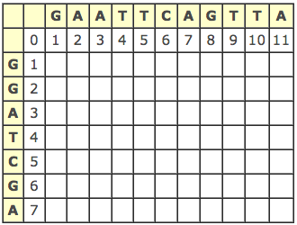
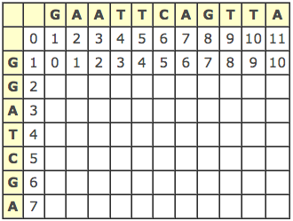
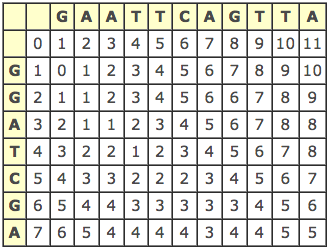
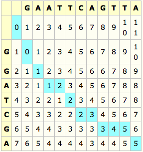

LD 算法
-----------------------------

LD算法(也称编辑距离算法)，是由俄国科学家Levenshtein提出的，所以又叫Levenshtein Distance(LD算法)。

该算法用于解决这样一类问题：有A、B两个字符串，将A字符串通过`删除一个字符`，`插入一个字符`，`修改一个字符`转变成B所需要的最少编辑距离。

其实它的只要思想就是动态规划。

本文参考了`万仓一黍`博客的[文本比较算法Ⅰ——LD算法](http://www.cnblogs.com/grenet/archive/2010/06/01/1748448.html)，大家也可以直接过去看原文，这里权当自己的学习笔记。

### 定义说明

我们用LD(A,B)表示字符串A与字符串B的编辑距离。  
Len(A)表示A的字长。

很显然，我们有:

LD(A,B) = LD(B,A)  
LD(A,A) = LD(A,A)  
LD(A,A) = 0  
LD(A,"") = Len(A)
...

现在令  
A = a1a2a3...an, 表示A由a1a2a3...an这N个字符组成，Len(A)=N  
B = b1b2b3...bm, 表示B由b1b2b3...bm这N个字符组成，Len(B)=M  

对于1<=i<=N, 1<=j<=M, 有公式：  
`若ai==bj, 则LD(i,j)=LD(i-1,j-1)`  
`若ai!=bj, 则LD(i,j)=Min(LD(i-1,j-1), LD(i-1,j), LD(i,j-1))+1`  

举个例子：A=GGATCGA, B=GAATTCAGTTA, 计算LD(A,B).

第一步：初始化LD矩阵

第二步：利用上述公式，计算第一行

第三步：利用公式，计算其余各行

则我们可以观察到最后一格，得知`LD(A,B)=5`.

我们可以从右下角回溯回左上角，回溯的方法按照，若ai==bj，则回溯回左上角；若ai!=bj，回溯到左上角、上边、左边中最小的单元格，优先级按照左上角、上边、左边的顺序。

第四步：根据回溯路径，写出匹配字串

若回溯到左上角单元格，将ai添加到匹配字串A，将bj添加到匹配字串B  
若回溯到上边单元格，将ai添加到匹配字串A，将\_添加到匹配字串B  
若回溯到左边单元格，将\_添加到匹配字串A，将bj添加到匹配字串B  

最终得到：

A：GGA\_TC\_G__A  
B：GAATTCAGTTA  

下面代码是实现输出LD矩阵：

	//LD algorithm implementation
	#include <iostream>
	#include <stdio.h>
	#include <string>
	#include <cstring>
	using namespace std;

	string a;
	string b;
	int **matrix;

	void Init_matrix(){
		for(int i=0; i<b.size()+1; i++)
			matrix[0][i] = i;

		for(int i=0; i<a.size()+1; i++)
			matrix[i][0] = i;
	}

	int LD(int i, int j){
		
		if(a[i-1]==b[j-1]){
			return matrix[i-1][j-1];
		}
		else{
			int min1 = matrix[i-1][j-1];
			int min2 = matrix[i-1][j];
			int min3 = matrix[i][j-1];

			int MIN = min1;
			if( min2 < MIN )
				MIN = min2;
			if( min3 < MIN )
				MIN = min3;

			return MIN+1;
		}
	}

	int main(){
		cin >> a >> b;
		matrix = new int*[a.size()+1];
		for(int i=0; i<a.size()+1; i++){
			matrix[i] = new int[b.size()+1];
			memset(matrix[i], 0, sizeof(matrix[i]));
		}

		Init_matrix();
		for(int i=1; i<=a.size(); i++){
			for(int j=1; j<=b.size(); j++){
				matrix[i][j] = LD(i, j);
			}
		}

		for(int i=1; i<=a.size(); i++){
			for(int j=1; j<=b.size(); j++){
				cout << matrix[i][j]<<" ";
			}
			cout<<endl;
		}

		for(int i=0; i<a.size()+1; i++){
			delete []matrix[i];
		}
		delete []matrix;
		return 0;
	}

LD算法如果要计算出匹配字符串的话，时间复杂度为O(MN)，空间复杂度为O(MN)。这样子在两个字符串都比较小的时候能获得不错的性能。但是对于两个长字符串，例如20000个字符，则LD矩阵需要约20000*20000*4byte=1.6G。所以在常字符串的时候，还有其它性能更好的算法。

