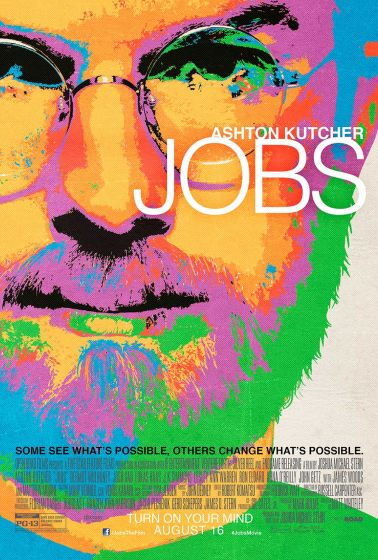

# Jobs

  

昨天终于看了有些期待的电影"Jobs"，为什么是有些期待呢？因为之前听说似乎拍得不怎么样，但因为它的题材我还是很感兴趣的，所以还是带着期待去看的。说实话，确实拍得不怎么样。电影期待能够cover乔布斯更多的故事，所以加了很多重要的片段在里面，但是这些片段，仅仅只能是成为电影中的片段，而不是故事的整体。当然，这也是传记电影难拍的地方，乔布斯的一生有很多东西可以写，有很多不能miss掉的重要事件在电影中都只能用几个镜头给呈现出来，导致电影显得有点破碎。

比起这部电影，我觉得《乔布斯传》更让人欣喜。《乔布斯传》不管在背景还是细节上都能够很好的呈现出来。毕竟读一本书总是比看一部电影需要更多的时间，也能更深入了解。推荐大家可以看一看这本书。

----------------------------------------------

Apple的产品做得真的很不错，不管是正在用的MacBook Pro，iPad，还是其它产品。Apple在工业设计和功能上都是值得推崇的。年初在台北，有一次去一个关于当代设计的博物馆的时候，竟然看到第一代的Macintosh! 虽然现在看起来第一代的Macintosh挺笨重的，但是当然不能用现在的眼光去评判过去的东西，我觉得这个Macintosh在当时也应该是一个革命性的东西。

不过话说回来，乔布斯已走，现在的Apple在没有乔布斯带领下，我觉得已经渐渐在走下坡。不再有像iPhone，iPad这样子革命性的产品出现。当然这个被咬了一口的苹果不管怎么样都不可能很快就腐烂。但是这样一个苹果不再是砸中乔布斯脑袋的苹果，而是又蜕变成赚取钱财的金苹果。

