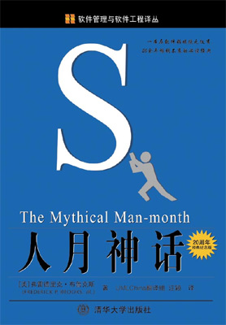
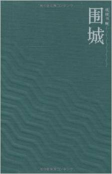
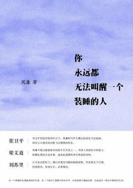
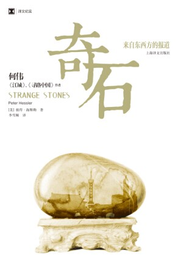
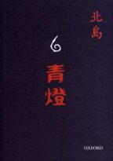
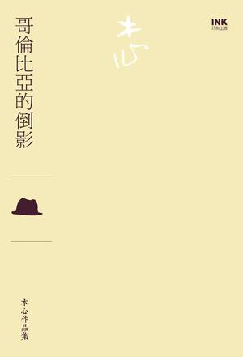
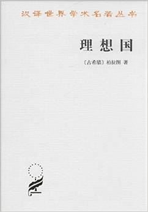
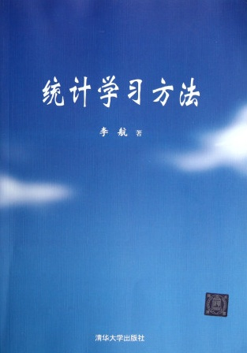

# My University Book List

------------------------------

在大一的时候自己给自己定了一个“大学四年要读100本书和看100部电影”的计划，电影当然是超出预期的100部了，因为看电影的需要的时间很短，而且无聊的时候看看就过去了。不过对于读书来说，暂时还没有读够。不过因为大学有在读书，所以觉得自己是有在成长的。所以说读书使人明智。下面我就列出自己从大一开始读过的书目名字，按时间的顺序，所以可能不是很有条理，不过权当是给自己读书的经历做一个总结，希望自己在大学毕业前完成这个计划。

ps: 大学四年读100本书 => 一年读书25本 => 一个月读2本 => 两个星期读1本书。

------------------------------

	★★★★★:	强烈推荐阅读(庆幸能够看到这本书)
	★★★★:	推荐阅读(值得花时间去看)
	☆☆☆:	可以看看(看了还是有收获)
	☆☆:		很普通(不看不影响任何东西)
	☆:		不推荐(感觉浪费了时间)

	1. 爱德加的故事 ☆☆
	2. 1988--我想和这个世界谈谈 ☆☆
	3. 创造自己 ☆☆☆
	4. 巴菲特传 ☆☆
	5. 我是一只IT小小鸟 ☆☆☆
	6. 风中的纸屑 ☆☆☆
	7. 人与永恒 ☆☆☆
	8. 联大教授 ☆☆☆
	9. 1Q84 book3 ★★★★
	10. 黄金时代 ☆☆☆

	11. The Alchemist ★★★★
	12. 肯定自己 ☆☆☆
	13. 沉默的大多数 ★★★★
	14. 白银时代 ☆☆☆
	15. 美国70年 ★★★★
	16. Veronika Decides to Die ☆☆☆
	17. 去最幸福的四国找幸福 ☆☆☆
	18. 爱因斯坦档案 ☆☆☆
	19. 内在的从容 ☆☆☆
	20. 海子传 ★★★★

	21. 一九八四 ☆☆☆
	22. 我执 ☆☆☆
	23. 重新发现社会 - 熊培云 ★★★★★
	24. 狼图腾 ★★★★
	25. 月亮和六便士 ☆☆☆
	26. 程序员的爱情 ☆
	27. 情人 ☆☆
	28. 历史深处的忧虑 ★★★★
	29. 寻路中国 - [美]彼得·海斯勒 ★★★★★
	30. 自由在高处 ★★★★

	31. 我读3 ☆☆☆
	32. 百年孤独 ★★★★
	32. 独立书店,你好 ☆☆☆
	34. 万历十五年 ★★★★
	35. 青春 ☆☆☆
	36. 活着 ★★★★★
	37. 公正 ★★★★
	38. 如彗星划过夜空 ★★★★
	39. 商海之恋 ☆
	40. 尘埃落定 ☆☆☆

	41. 送你一颗子弹 ★★★★
	42. 民主的细节 ★★★★
	43. 许三观卖血记 ★★★★
	44. 常识 ★★★★
	45. 史蒂夫·乔布斯传 ★★★★
	46. Charlotte's Web ☆☆☆
	47. 新月集·飞鸟集 ☆☆☆
	48. Animal Farm ☆☆☆
	49. 江城 ★★★★
	50. 你一定爱读的极简欧洲史 ☆☆☆

	51. 我读4 ☆☆☆
	52. 三重门 ☆☆☆
	53. 台湾,你一定要去 ☆☆
	54. 野火集 ★★★★
	55. 大中东行纪 ☆☆☆
	56. 北京, 最后的纪念 ☆☆☆
	57. 国境以南 太阳以西 ☆☆☆
	58. 带一本书去巴黎 ☆☆☆
	59. 大江大海1949 ★★★★
	60. 骆驼祥子 ☆☆☆

	61. 董桥文集1 ☆☆☆
	62. 甲骨文 ★★★★
	63. 蛙 ★★★★
	64. 最后的贵族 - 章诒和 ★★★★★
	65. 朝鲜是个谜 ☆☆
	66. 三体 ★★★★
	67. 蓝房子 - 北岛 ☆☆☆
	68. 古老的敌意 - 北岛 ☆☆☆
	69. 乡关何处 - 野夫 ☆☆☆
	70. 老广新游 ☆☆

	71. 世间的盐 - 高军 ☆☆☆
	72. 把时间当作朋友 - 李笑来 ★★★★
	73. 奇特的一生 - [苏]格拉宁 ☆☆☆
	74. 数学之美与浪潮之巅 - 吴军 ☆☆☆
	75. 观念的水位 - 刘瑜 ★★★★
	76. 看见 - 柴静 ★★★★
	77. 我所理解的生活 - 韩寒 ☆☆☆
	78. 思想国 - 熊培云 ☆☆☆
	79. 每天读一点时间简史 - [英]霍金(原) 王宇琨(编) ☆☆☆
	80. 黑客与画家 - [美]Paul Graham(原) 阮一峰(译) ★★★★

	81. 推荐系统实践 - 项亮 ★★★★
	82. 平如美棠 - 饶平如 ☆☆☆
	83. 上帝掷骰子吗:量子物理史话 - 曹天元 ★★★★
	84. 一分钟能做什么?:不可思议的"战拖"心理学 - Jeff Davidson ☆☆
	85. 美国, 真的和你想的不一样 - 王逅逅 ☆☆☆
	86. 目送 - 龙应台 ★★★★
	87. 亲爱的安德烈 - 龙应台 ☆☆☆
	88. 中国在梁庄 - 两鸿 ★★★★
	89. 樱桃之书 - 杨昌溢 ☆☆☆
	90. 牛奶可乐经济学 - [美]Robert H Frank ☆☆☆

	91. 微软的梦工厂 - 微软亚洲研究院 ★★★★
	92. 寻一个不受人惑的人 - 胡适 ★★★★
	93. 一座城池 - ☆☆

到现在为止看了93本书。五星的有4本，四星的有33本，三星的有45本，两星的有9本，一星的有2本。

五颗星的4本书分别是`熊培云`先生的`《重新发现社会》`、美国作家`彼得·海斯勒`的`《寻路中国》`、`余华`先生的`《活着》`还有`张诒和`女士的`《最后的贵族》`。

---------------------------------------------------------------------------

最后还是没看完100本书呀~ 大学四年看了93本书，让自己认识了更多。那么没看完的7本就滚存到我研究生读书计划吧。(Sept. 16, 2014) 打 * 号的是技术书。

---------------------------------------------------------------------------

	1. 三体II·黑暗森林 - 刘慈欣 ★★★★
	2. 剑指Offer* - 何海涛 ★★★★ 
	3. 徒步中国 - [德]Christoph Rehage/雷克 ☆☆
	4. 淘宝技术这十年 - 子柳 ☆☆☆
	5. 沸腾十五年 - 林军 ★★★★
	6. 三体III·死神永生 - 刘慈欣 ★★★★★	{科幻小说最好看的不是科技而是人性}
	7. 大教堂与集市 - [美]Eric Steven Raymond ★★★★	{对开源软件有些独到的观点}
	8. 改变未来的九大算法 - [美]John MacCormick ☆☆☆ {相对来说还是浅了点，属于计算机科普丛书}
	9. Effective C++* - [美]Scott Meyers ★★★★ {有不少值得注意的地方，泛型编程那章没有仔细看}
	10. 编码的奥秘* - [美]Charles Petzold ☆☆☆ {从0开始学习计算机组成原理}

-------------------------------------------------------------------

	11. 人月神话* - [美]FrederickP. Brooks. Jr. ★★★★ 

		ISBN: 978-7-302-05932-5
		出版社:清华大学出版社

		{恰好在实习期间读了这本书，书中所讲内容三十多年后的今天依然适用}
 

---------------------------------------------------------------------------
	
	12.	围城 - 钱钟书 ★★★	

		ISBN: 978-7-02-002475-9
		出版社:人民文学出版社

		{人生就是一座围城，每每想突破现状重新开始，却又反反复复重蹈覆辙}
 

-------------------------------------------------------------------

	13.	你永远都无法叫醒一个装睡的人 - 周濂 ★★★★	

		ISBN: 978-7-300-15220-2
		出版社:中国人民大学出版社

		{坦诚面对人性是不完善的事实，唯有价值而非利益之争才能最终将社会导向好的一面}
 

-------------------------------------------------------------------

	14.	奇石 - [美]彼得·海斯勒 ★★★★	8.5/10

		ISBN: 978-7-5327-6495-2
		出版社:上海译文出版社

		{何伟的故事总是那么的日常却又那么的深邃，让读者看到自己生活的另一面。
		正如书名所说，中国就像一块奇石，有千千万万种韵味掩藏其中}

 

-------------------------------------------------------------------

	15.	青灯 - 北岛 ★★★★	8.2/10

		ISBN: 978-0-19-548577-6
		出版社:牛津大学出版社

		{北岛的散文比他的诗歌更具魅力，他的文字总带有漂泊者所独有的味道。
		仿如一盏青灯，在漆黑的深夜带来暖暖的光芒}

 

-------------------------------------------------------------------

	16.	哥伦比亚的倒影 - 木心 ★★★	7.9/10

		ISBN: 978-986-5933-21-0
		出版社:印刻文學生活雜誌出版有限公司

		{木心，是用艺术家的角度写散文。如果你不懂得他的心，你就看不懂他的散文。读木心的散文让我想起了阎连科和季羡林。
		文笔上木心和阎连科给我的感觉有那么一点相似，而在情感上又和季老先生相似。
		不过木心特别的地方在于他的文字间能读到一位风尘仆仆游子的感觉}

 

	17.	理想国 - [古希腊]柏拉图 ★★★	7.9/10

		ISBN: 978-7-100-01756-5
		出版社:商务印书馆

		{我很难去评价两千多年前苏格拉底的思想对今天的作用，因为有不少地方碍于当时的知识水平的限制，现在看来有点无稽之谈。
		然而不能否定与赞叹的是距今这么久远的苏格拉底已经在思考什么是正义，什么样能建立一个好的城邦。
		本书前半段很精彩，后半段还有中途一些地方稍显啰嗦与乏味}

 

	18.	统计学习方法* - 李航 ★★★★★	9.0/10

		ISBN: 978-7-302-27595-4
		出版社:清华大学出版社

		{在有一定的数据挖掘/机器学习基础后，看看这本书，能很好的提升对这些算法的理解。书中讲解概念和例子都让人容易理解算法，但是公式推导还是让我有点吃不消。}

 

