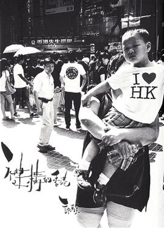
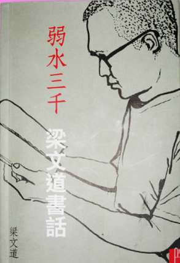
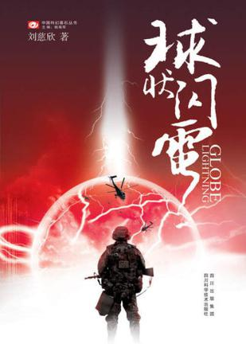
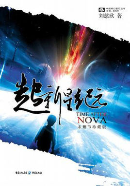
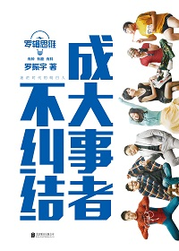
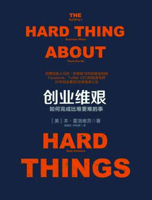
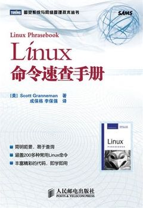
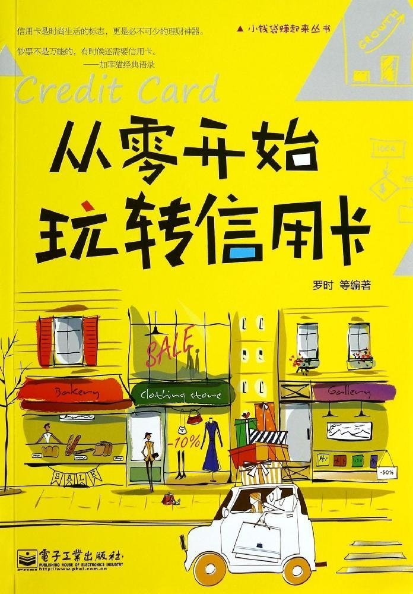
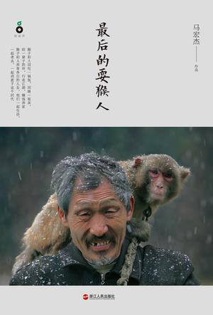

# My University Book List

------------------------------

在大一的时候自己给自己定了一个“大学四年要读100本书和看100部电影”的计划，电影当然是超出预期的100部了，因为看电影的需要的时间很短，而且无聊的时候看看就过去了。不过对于读书来说，暂时还没有读够。不过因为大学有在读书，所以觉得自己是有在成长的。所以说读书使人明智。下面我就列出自己从大一开始读过的书目名字，按时间的顺序，所以可能不是很有条理，不过权当是给自己读书的经历做一个总结，希望自己在大学毕业前完成这个计划。

ps: 大学四年读100本书 => 一年读书25本 => 一个月读2本 => 两个星期读1本书。

------------------------------

	★★★★★:	强烈推荐阅读(庆幸能够看到这本书)
	★★★★:	推荐阅读(值得花时间去看)
	☆☆☆:	可以看看(看了还是有收获)
	☆☆:		很普通(不看不影响任何东西)
	☆:		不推荐(感觉浪费了时间)

	1. 爱德加的故事 ☆☆
	2. 1988--我想和这个世界谈谈 ☆☆
	3. 创造自己 ☆☆☆
	4. 巴菲特传 ☆☆
	5. 我是一只IT小小鸟 ☆☆☆
	6. 风中的纸屑 ☆☆☆
	7. 人与永恒 ☆☆☆
	8. 联大教授 ☆☆☆
	9. 1Q84 book3 ★★★★
	10. 黄金时代 ☆☆☆

	11. The Alchemist ★★★★
	12. 肯定自己 ☆☆☆
	13. 沉默的大多数 ★★★★
	14. 白银时代 ☆☆☆
	15. 美国70年 ★★★★
	16. Veronika Decides to Die ☆☆☆
	17. 去最幸福的四国找幸福 ☆☆☆
	18. 爱因斯坦档案 ☆☆☆
	19. 内在的从容 ☆☆☆
	20. 海子传 ★★★★

	21. 一九八四 ☆☆☆
	22. 我执 ☆☆☆
	23. 重新发现社会 - 熊培云 ★★★★★
	24. 狼图腾 ★★★★
	25. 月亮和六便士 ☆☆☆
	26. 程序员的爱情 ☆
	27. 情人 ☆☆
	28. 历史深处的忧虑 ★★★★
	29. 寻路中国 - [美]彼得·海斯勒 ★★★★★
	30. 自由在高处 ★★★★

	31. 我读3 ☆☆☆
	32. 百年孤独 ★★★★
	32. 独立书店,你好 ☆☆☆
	34. 万历十五年 ★★★★
	35. 青春 ☆☆☆
	36. 活着 ★★★★★
	37. 公正 ★★★★
	38. 如彗星划过夜空 ★★★★
	39. 商海之恋 ☆
	40. 尘埃落定 ☆☆☆

	41. 送你一颗子弹 ★★★★
	42. 民主的细节 ★★★★
	43. 许三观卖血记 ★★★★
	44. 常识 ★★★★
	45. 史蒂夫·乔布斯传 ★★★★
	46. Charlotte's Web ☆☆☆
	47. 新月集·飞鸟集 ☆☆☆
	48. Animal Farm ☆☆☆
	49. 江城 ★★★★
	50. 你一定爱读的极简欧洲史 ☆☆☆

	51. 我读4 ☆☆☆
	52. 三重门 ☆☆☆
	53. 台湾,你一定要去 ☆☆
	54. 野火集 ★★★★
	55. 大中东行纪 ☆☆☆
	56. 北京, 最后的纪念 ☆☆☆
	57. 国境以南 太阳以西 ☆☆☆
	58. 带一本书去巴黎 ☆☆☆
	59. 大江大海1949 ★★★★
	60. 骆驼祥子 ☆☆☆

	61. 董桥文集1 ☆☆☆
	62. 甲骨文 ★★★★
	63. 蛙 ★★★★
	64. 最后的贵族 - 章诒和 ★★★★★
	65. 朝鲜是个谜 ☆☆
	66. 三体 ★★★★
	67. 蓝房子 - 北岛 ☆☆☆
	68. 古老的敌意 - 北岛 ☆☆☆
	69. 乡关何处 - 野夫 ☆☆☆
	70. 老广新游 ☆☆

	71. 世间的盐 - 高军 ☆☆☆
	72. 把时间当作朋友 - 李笑来 ★★★★
	73. 奇特的一生 - [苏]格拉宁 ☆☆☆
	74. 数学之美与浪潮之巅 - 吴军 ☆☆☆
	75. 观念的水位 - 刘瑜 ★★★★
	76. 看见 - 柴静 ★★★★
	77. 我所理解的生活 - 韩寒 ☆☆☆
	78. 思想国 - 熊培云 ☆☆☆
	79. 每天读一点时间简史 - [英]霍金(原) 王宇琨(编) ☆☆☆
	80. 黑客与画家 - [美]Paul Graham(原) 阮一峰(译) ★★★★

	81. 推荐系统实践 - 项亮 ★★★★
	82. 平如美棠 - 饶平如 ☆☆☆
	83. 上帝掷骰子吗:量子物理史话 - 曹天元 ★★★★
	84. 一分钟能做什么?:不可思议的"战拖"心理学 - Jeff Davidson ☆☆
	85. 美国, 真的和你想的不一样 - 王逅逅 ☆☆☆
	86. 目送 - 龙应台 ★★★★
	87. 亲爱的安德烈 - 龙应台 ☆☆☆
	88. 中国在梁庄 - 梁鸿 ★★★★
	89. 樱桃之书 - 杨昌溢 ☆☆☆
	90. 牛奶可乐经济学 - [美]Robert H Frank ☆☆☆

	91. 微软的梦工厂 - 微软亚洲研究院 ★★★★
	92. 寻一个不受人惑的人 - 胡适 ★★★★
	93. 一座城池 - 韩寒 ☆☆

到现在为止看了93本书。五星的有4本，四星的有33本，三星的有45本，两星的有9本，一星的有2本。

五颗星的4本书分别是`熊培云`先生的`《重新发现社会》`、美国作家`彼得·海斯勒`的`《寻路中国》`、`余华`先生的`《活着》`还有`张诒和`女士的`《最后的贵族》`。

---------------------------------------------------------------------------

最后还是没看完100本书呀~ 大学四年看了93本书，让自己认识了更多。那么没看完的7本就滚存到我研究生读书计划吧。(Sept. 16, 2014) 打 * 号的是技术书。

---------------------------------------------------------------------------

	94. 三体II·黑暗森林 - 刘慈欣 ★★★★★
	95. 剑指Offer* - 何海涛 ★★★★ 
	96. 徒步中国 - [德]Christoph Rehage/雷克 ☆☆
	97. 淘宝技术这十年 - 子柳 ☆☆☆
	98. 沸腾十五年 - 林军 ★★★★
	99. 三体III·死神永生 - 刘慈欣 ★★★★	{科幻小说最好看的不是科技而是人性}
	100. 大教堂与集市 - [美]Eric Steven Raymond ★★★★	{对开源软件有些独到的观点}

	101. 改变未来的九大算法 - [美]John MacCormick ☆☆☆ {相对来说还是浅了点，属于计算机科普丛书}
	102. Effective C++* - [美]Scott Meyers ★★★★ {有不少值得注意的地方，泛型编程那章没有仔细看}
	103. 编码的奥秘* - [美]Charles Petzold ☆☆☆ {从0开始学习计算机组成原理}
	104. 人月神话* - [美]FrederickP. Brooks. Jr. ★★★★
	105. 围城 - 钱钟书 ★★★
	106. 你永远都无法叫醒一个装睡的人 - 周濂 ★★★★
	107. 奇石 - [美]彼得·海斯勒 ★★★★  8.7/10
	108. 青灯 - 北岛 ★★★★  8.5/10
	109. 哥伦比亚的倒影 - 木心 ☆☆☆  7.8/10
	110. 理想国 - [古希腊]柏拉图 ☆☆☆  8.0/10

	111. 统计学习方法* - 李航 ★★★★★  9.0/10
	112. 被建构的香港 - 许骥 ★★★★  8.4/10
	113. 弱水三千 - 梁文道 ★★★★	8.1/10
	114. 球状闪电 - 刘慈欣 ★★★★	8.5/10
	115. 超新星纪元 - 刘慈欣 ★★★★ 8.5/10

---

现在步入职场了，也该看看研究生时代的书有没有读够。研究生时代看了22本书，五颗星的书有两本，一本是`刘慈欣`的`《三体II·黑暗森林》`，确实是巅峰之作。还有一本是`李航`先生的`《统计学习方法》`，如此通俗又不简单的介绍机器学习与数据挖掘知识，这本书确实好。

研究生时期主要看了科技类与科幻类的数据，主要当时为了找工作，还有就是想看看刘慈欣的其他作品。本科加研究生一共看了115本书，也算是个读书人了。今后也当继续看书，养成好习惯。(Sept. 19, 2015)

---

当然下面开始是我进入职场后的书单啦。

	116. 罗辑思维:成大事者不纠结 - 罗振宇 ☆☆ 7.7/10
	117. 创业维艰 - [美]Ben Horowitz ☆☆☆ 8.0/10
	118. 禅与摩托车维修艺术 - [美] Robert M. Pirsig ☆☆☆ 8.2/10
	119. Linux 命令速查手册* - [美] Scott Granneman ☆☆☆ 8.2/10
	120. 从零开始玩转信用卡 - 罗时 ☆ 5.0/10

	121. 龙应台的香港笔记 - 龙应台 ★★★★ 8.5/10
	122. 最后的耍猴人 - 马宏杰 ★★★★ 9.0/10

-------------------------------------------------------------------

	104. 人月神话* - [美]FrederickP. Brooks. Jr. ★★★★ 

		ISBN: 978-7-302-05932-5
		出版社:清华大学出版社

		{恰好在实习期间读了这本书，书中所讲内容三十多年后的今天依然适用}
 

---------------------------------------------------------------------------
	
	105. 围城 - 钱钟书 ★★★	

		ISBN: 978-7-02-002475-9
		出版社:人民文学出版社

		{人生就是一座围城，每每想突破现状重新开始，却又反反复复重蹈覆辙}
 

-------------------------------------------------------------------

	106. 你永远都无法叫醒一个装睡的人 - 周濂 ★★★★	

		ISBN: 978-7-300-15220-2
		出版社:中国人民大学出版社

		{坦诚面对人性是不完善的事实，唯有价值而非利益之争才能最终将社会导向好的一面}
 

-------------------------------------------------------------------

	107. 奇石 - [美]彼得·海斯勒 ★★★★	8.7/10

		ISBN: 978-7-5327-6495-2
		出版社:上海译文出版社

		{何伟的故事总是那么的日常却又那么的深邃，让读者看到自己生活的另一面。
		正如书名所说，中国就像一块奇石，有千千万万种韵味掩藏其中}

 

-------------------------------------------------------------------

	108. 青灯 - 北岛 ★★★★	8.5/10

		ISBN: 978-0-19-548577-6
		出版社:牛津大学出版社

		{北岛的散文比他的诗歌更具魅力，他的文字总带有漂泊者所独有的味道。
		仿如一盏青灯，在漆黑的深夜带来暖暖的光芒}

 

-------------------------------------------------------------------

	109. 哥伦比亚的倒影 - 木心 ★★★	8.0/10

		ISBN: 978-986-5933-21-0
		出版社:印刻文學生活雜誌出版有限公司

		{木心，是用艺术家的角度写散文。如果你不懂得他的心，你就看不懂他的散文。读木心的散文让我想起了阎连科和季羡林。
		文笔上木心和阎连科给我的感觉有那么一点相似，而在情感上又和季老先生相似。
		不过木心特别的地方在于他的文字间能读到一位风尘仆仆游子的感觉}

 

-------------------------------------------------------------------

	110. 理想国 - [古希腊]柏拉图 ★★★	8.0/10

		ISBN: 978-7-100-01756-5
		出版社:商务印书馆

		{我很难去评价两千多年前苏格拉底的思想对今天的作用，因为有不少地方碍于当时的知识水平的限制，现在看来有点无稽之谈。
		然而不能否定与赞叹的是距今这么久远的苏格拉底已经在思考什么是正义，什么样能建立一个好的城邦。
		本书前半段很精彩，后半段还有中途一些地方稍显啰嗦与乏味}

 

-------------------------------------------------------------------

	111. 统计学习方法* - 李航 ★★★★★ 9.0/10	

		ISBN: 978-7-302-27595-4
		出版社:清华大学出版社

		{在有一定的数据挖掘/机器学习基础后，看看这本书，能很好的提升对这些算法的理解。
		书中讲解概念和例子都让人容易理解算法，但是公式推导还是让我有点吃不消。}

 

-------------------------------------------------------------------

	112. 被建构的香港 - 许骥 ★★★★	8.4/10

		ISBN: 978-988-13048-1-0
		出版社:文化工房

		{作者作为一个“三手香港人”(祖籍福建、生于浙江、住在香港)实际上对香港和内地间的关系、文化都有透彻的了解。
		书分两部分，前半段讲的是: 书、书店、书匠、书展，后半段讲的是: 香港文化、社会、两地交流。
		全书都很合我胃口，我原是被后半段的内容吸引的，想不到前半段也如此合我意。
		尤其我作为一个受香港文化辐射影响的深圳人，作者对社会现象的许多观点我觉得都直接戳中要害。
		一个作家对一座城市有如此深入的描写，证明他热爱这座城市。}

 

-------------------------------------------------------------------

	113. 弱水三千 - 梁文道 ★★★★	8.1/10

		ISBN: 978-988-99286-3-6
		出版社:上书局

		{世界上有那么多事情可以做，为什么要读书?
		但是反过来想一下，为什么不呢? 
		不读书的人常用的一个理由是:忙。
		不过读书并不是一件需要完整时间才能做成的事情，它不像运动、工作需要一整段完整的时间；
		甚至它没有时间、空间的要求。巴士、地铁、等电梯、公园休息、睡前等头发干，都可以成为你读书的时间。
		不过实际上阅读并没有消失，它只是转变了一种方式，从看纸质书变成了刷朋友圈、看视频，本质上依然是在“阅读”。

		与“阅读”相反的概念不是“不阅读”，而是“无法阅读”。
		“不阅读”是有能力而不为之，“无法阅读”是连阅读的能力都没有。这里可能有人会误会我说的是不识字的文盲。
		诚然他们是“无法阅读”的其中一种，但是我更想强调的是“环境让你无法阅读”。

		在科大读书生活的这一年很多时候会在图书馆中度过。忘了是为什么，突然觉醒还有三个月就离开这个校园。
		看着诺大的图书馆，心中是一阵可惜，因为我竟没有在图书馆借过一本书。
		而他日如果有想看的书，绝不会像科大图书馆那样方便了。于是才奋起“读书”。

		梁文道的《弱水三千》正如他说的一样不是一个推荐书单，权当是他的课外阅读报告。
		不过这个课外阅读报告也让我了解到很多有趣的读物。
		尤其梁文道的总是有种故事人的气质在其中，先讲个精彩的故事开头给你听，引起你的兴趣，
		然后再告诉你欲知结果如何，请自行到书中分解。
		一个出色的故事匠应当如此，一个说书匠不也应当如此吗?}

 

-------------------------------------------------------------------

	114. 球状闪电 - 刘慈欣 ★★★★	8.5/10

		ISBN: 978-7-5364-5538-2
		出版社:四川科学技术出版社

		{你很难不佩服一个能将儿时的奇思妙想转化成小说，而且写得有理有据的人。没错这个人就是刘慈欣。
		从《三体》开始喜欢上这样一位思维极广的科幻小说作家。

		《球状闪电》是在《三体》前的长篇小说，虽然没有达至《三体》这样的巅峰，但是也颇值得一看。
		虽然感觉结尾仓促草率了点，但是过程还是蛮有意思的。

		刘慈欣很擅长带领这种有着一些科学知识的读者，一步一步进入他的科幻世界，使得这个世界更为真实。
		更重要的是科幻小说最好看的就是讲人性，只有在面对巨变的时代，才能丰富展现不同人的人性。}

 

-------------------------------------------------------------------

	115. 超新星纪元 - 刘慈欣 ★★★★	8.5/10

		ISBN: 978-7-229-00476-7
		出版社:重庆出版社

		{你有没有想过当这个世界都是由无知的人组成会怎么样?
		这就是《超新星纪元》的故事设定。
		由于超新星的爆发，导致地球上13岁以上的人类灭亡，小孩子因为自我修复能力强而幸免于难。
		世界由孩子们接管。

		书中最精彩的部分是，当大人完全死去，世界由一群无知的孩子领导。
		孩子们只懂得玩乐，不用考虑后果等，让我想到了文革时期。
		可能刘慈欣这本书的灵感也是来自于文革。

		无知即无畏。
		规则被颠覆，世界格局被改变，“玩”成了这个世界的一切标准。

		突然理解到生活在文革中的很多人，为什么会选择自杀。
		那是因为生活的荒唐已破坏了他们内心的心理建筑。}

 

-------------------------------------------------------------------

	116. 罗辑思维:成大事者不纠结 - 罗振宇 ☆☆☆ 7.7/10

		ISBN: 978-7-5502-4414-6
		出版社: 北京联合出版有限责任公司

		{罗振宇算是一个把历史说得比较有趣的人。
		说起来也是从他的罗辑思维视频开始关注他的。

		如今越来越多的自媒体，接地气的说书，看来是一种趋势。
		相比于历史，我更喜欢他讲各方各面的书籍，科技、奇闻、金融、政治...
		这些方面愿意说书的人太少了。

		这本书主要讲的就是满清朝廷的个人奋斗史(李鸿章、曾国藩、嘉庆...)
		这些人的故事从来都是每看每忘，再看再忘。
		所以本书对我的意义就是消磨消磨时间，并没过多惊艳我的地方。}

 

-------------------------------------------------------------------

	117. 创业维艰 - [美]Ben Horowitz ☆☆☆ 8.0/10

		ISBN: 978-7-5086-4664-0
		出版社: 中信出版社

		{近几年才发现创业、风投市场是多么的活跃。
		互联网大热，加上热钱涌入，创业公司真的雨后春笋的冒出来。
		
		这本书给我带来了一个很好的视角——CEO是如何经营一家公司的。
		虽然我没有当CEO的想法，但是谁不愿意拥有一家改变世界的科技公司呢？
		Ben讲了他如何创立起公司，公司遇到困难他是怎么解决的，同时也提供了给人借鉴的方法。
		
		不过我觉得不成功的公司都有各种原因，但成功公司一定都有一个特质——优秀的人。
		所以Ben的方法论更多的说只是他自己面对困难时候的经验之谈，
		要成为一个优秀的CEO/创业者，这个人一定需要不断学习不断实践。}

 

-------------------------------------------------------------------

	118. 禅与摩托车维修艺术 - [美] Robert M. Pirsig ☆☆☆ 8.2/10

		ISBN: 978-7-229-04036-9
		出版社: 重庆出版社

		{禅与摩托车维修有什么关系？
		我一向喜欢看游记、文化这类型的书籍，这本书游记的部分还过得去。
		本来觉得平平无奇，直到作者开始在书中谈论到斐洛特这个人物后，文章变得有趣。

		书中作者驱车行走的路线是斐洛特曾经走过的路线，斐洛特的人生经历也是非常独特。
		斐洛特究竟是谁？聪明的读者可能知道，这个斐洛特就是作者自己，但是这不是他胡编乱造出来的人。
		我更愿意相信这个斐洛特是作者用来代表自己前半生，在被世人认为“疯了”的时期的自己。

		我觉得全书最精彩的部分是临近结束前的1/4章节。它从游记上升为哲学。
		你怎么感知这个世界。

		如果你知道没油，车就会停下来，那么当真的没油，你知道车会停下来，这是演绎法。
		如果你发现车停下，是车没油了，那么这是归纳法。

		前者称为古典，通过掌握一系列理论，认知一个世界；
		后者称为浪漫，通过一些列现象积累，认知一个世界。

		禅是如此的抽象，而摩托车维修是那么的具象。
		作者在最后的几章带领着我们去思考怎么认知这个世界。}

 

-------------------------------------------------------------------

	119. Linux 命令速查手册 - [美] Scott Granneman ☆☆☆ 8.2/10

		ISBN: 978-7-115-21345-7
		出版社: 人民邮电出版社

		{工作了，发现Linux的知识不足，赶紧补一补。
		这本书含括了Linux的基本命令，确实是基本命令。
		虽然是基本，却也弥补了我一下盲点。对于初入Linux没看过相关书籍的人比较适合。

		Linux之路依然艰巨，但也要不断学习。}

 

-------------------------------------------------------------------

	120. 从零开始玩转信用卡 - 罗时 ☆ 5.0/10

		ISBN: 978-7-121-23399-9
		出版社: 电子工业出版社

		{这是本工具书。

		本以为这本书会介绍一下信用卡有趣的历史、一些生活案例。
		但是想不到90%内容都是介绍我国不同银行的信用卡，简直是一本信用卡说明书大全。

		唯一能带给我的新知识是一个观念：不向银行借钱的人，在银行眼中是一个没有信用的人。
		这个观念说得很有趣，用一种反差突出观念。
		但是想一想，确实是正确的。

		自己是已经有信用卡了，看这本书觉得纯粹浪费时间，
		但是如果你是一个还没有信用卡的人，你获取可以翻翻看，你适合在什么银行开什么卡。}

 

-------------------------------------------------------------------

	121. 龙应台的香港笔记 - 龙应台 ★★★★ 8.5/10

		ISBN: 978-988-211-604-7
		出版社: 天地图书

		{龙应台在2004-2012年作为香港大学的客座教授居住在香港座城市当中。
		
		这本书断断续续看了半年，龙应台的文章是可以增长自己见识的，
		龙应台作为一个台湾人，对比台湾来看香港，对比欧洲来看世界，看到很多不一样的点。
		政府如何决策，人民如何生活，当然还会在某些特殊日子讲讲历史故事。

		香港和台湾两个地方我都待过一年半载，给我的感受确实与众不同的。
		台湾: 闲适安详，感觉自己可以融入这个地方；香港: 充满活力，但是却更像个局外人。}

 

-------------------------------------------------------------------

	122. 最后的耍猴人- 马宏杰 ★★★★ 9.0/10

		ISBN: 978-7-213-06495-1
		出版社: 浙江人民出版社

		{通过一本书，你了解一群人。

		记得小时候，坐在出租车内，看到带着猴子在马路上讨钱的耍猴人，
		这是一群怎么样的人？似乎从来没有人关心。

		突然想了解这群人，是因为书名上“最后”二字。他们是存在于也消失于这一代的人。
		证过这样一群人，但是他们即将消失，所以让我突然想了解他们，想知道他们的生活究竟怎样。

		河南，其实不产猴子，但是很多耍猴人都是从河南出来的，大家是不是觉得这和河南的经济发展有关系？
		或许是这样。但是，河南其实有很悠久的耍猴的历史。

		耍猴人有的时候会故意跟猴子发起冲突，例如用鞭子抽他们；猴子也会用石头仍耍猴人。
		但是书中有句话道出了真实的一切。耍猴人不会真的打到猴子，因为如果打坏了猴子，他们就赚不到钱了。
		所以，这一切都是一种表演。

		更古老的耍猴人其实是让猴子带面目演戏剧，但是这种如此煞费时间，受众又少的耍猴人渐渐的消失了。
		后来的耍猴人主要就是让猴子学人，鞠躬、鼓掌、点头、与人打闹。
		当然还有的耍猴人，已经不能依靠表演来养活自己，只能沦为马路上乞讨的人。

		耍猴人有很多我们不知道的事情。例如他们会去不同的地方表演，但是都是通过扒火车的方式去不同地方，
		扒火车是很危险的事情，于是导致很多事故，但是为了生活，他们依然这样做。
		与火车站的工作人员抓迷藏，与城管抓迷藏。
		其实，他们都是为了生活。

		让我最受感动是耍猴人与猴子的感情。
		猴子的寿命大概是30年，当然很多猴子不会活到这个岁数。他们其实就是耍猴人的家人。
		同吃、同住、同睡，猴子养活了耍猴人的一家，耍猴人也把猴子当作家人。
		
		这本书，让我了解最后的耍猴人。}

 

