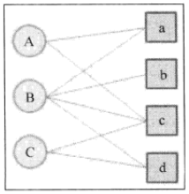
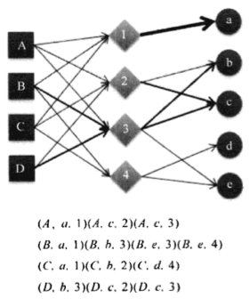

# 《推荐系统实践》读书笔记

-------------------------

### 第1章 好的推荐系统

搜索引擎: 满足用户明确的主动需求  
推荐系统: 帮助用户发现潜在兴趣

社会化推荐(social recommendation): 让好友给自己推荐物品  
基于内容的推荐(content base filtering): 推荐相通类似的物品  
协同过滤推荐(collaborative filtering): 找类似用户进行推荐  

Amazon推荐系统的用户界面:  
1. 推荐结果的标题、缩略图一起其它内容属性  
2. 推荐结果的平均分  
3. 推荐理由  
4. 用户反馈  

Fix this recommendation(Amazon):  
1. Add to Cart  
2. Add to Wish List  
3. Rate this item  
4. I own it  
5. Not interested  

相关推荐列表最重要的应用就是`打包销售(cross selling)`。当你购买某个物品的时候，系统会告诉你其它用户在购买这个商品的同时会购买的其它几个商品。

Youtube曾做过一个实验，比较了个性化推荐的点击率和热门视频列表的点击率，实验结果表明个性化的推荐的点击率是热门视频点击率的两倍。

***(Pandora音乐推荐)*** Pandora的算法主要基于内容，其音乐家和研究人员亲自听了上万首来自不同歌手的歌，然后对歌曲的不同特征(比如旋律、节奏、编曲和歌词等)进行标注，这些标注被称为音乐的基因。然后，Pandora会根据专家标注的基因计算歌曲的相似度，并给用户推荐和他之前喜欢的音乐在基因上相似的其它音乐。

***(Last.fm音乐推荐)*** Last.fm记录了所有用户的听歌记录以及用户对歌曲的反馈，在这一基础上计算出不通用户在歌曲上的喜好相似度，从而给用户推荐和他有相似听歌爱好的其他用户喜欢的歌曲。主要利用用户行为计算歌曲相似度。

----------------------------------------------------------------------------

### 推荐系统实验方法:

1. 离线实验
2. 用户调查
3. 在线实验(eg. AB测试)

AB测试是一种常用的在线评测算法的实验方法。它通过一定的规则讲用户随机分成几组，并对不同组的用户采用不通的算法，然后通过统计不通用户的各种不同的评测指标比较不同算法，比如可以统计不同组用户的点击率，通过点击率比较不同算法的性能。

----------------------------------------------------------------------------

### 评测指标:

1. 用户满意度(eg. 豆瓣电台 红心与垃圾箱)
2. 预测准确度  
	a. 评分预测: 用户对物品打的分数与推荐算法对物品的预测评分  
	b. TopN推荐: 给用户一个个性化推荐列表。预测准确率通过准确率(precision)/召回率(recall)度量
3. 覆盖率(推荐系统能够推荐出来的物品占总物品集合的比例) 
4. 多样性
5. 新颖性(推荐用户他们没有听说过的物品)
6. 惊喜性(推荐结果与用户历史兴趣不相似，但却让用户觉得很满意)
7. 信任度
8. 实时性(eg. 新闻)
9. 健壮性(robust, 抗击作弊的能力)
10. 商业目标

***(召回率 Recall)*** 系统检索到的相关文件数 / 相关文件总数

***(准确率 Precise)*** 系统检索到的相关文件数 / 系统返回的文件总数

亚马逊前科学家Greg Linden指出，电影推荐的目的是找到用户最有可能感兴趣的电影，而不是预测用户看完了电影后会给电影什么样的评分。因此TopN推荐更符合实际的应用需求。因此用户是否会看一部电影，应该比预测用户看了电影后会给它什么评分更加重要。

***(马太效应)*** 如果一个系统会曾佳大热门的物品和非热门物品的流行度差距，让热门的物品更加热门，不热门的物品更加不热门，那么这个系统就有马太效应。eg. 首页的热门排行榜

推荐系统的初衷是希望消除马太效应，使得各种物品都能被展示给对它们感兴趣的某一类人群。但是，很多研究表明现在流星的推荐算法(比如协同过滤算法)是具有马太效应的。

----------------------------------------------------------------------------
----------------------------------------------------------------------------

### 第2章 利用用户行为数据

用户行为在个性化推荐系统中一般分两种:  

1. 显性反馈行为(explicit feedback): 喜欢与不喜欢  
2. 隐形反馈行为(implicit feedback): eg. 浏览的页面  

***(Zipf定律)*** 1932年，哈佛大学的语言学家Zipf在研究英文单词的词频时发现，如果将单词出现的频率按照由稿到低排列，则每个单词出现的频率和它在热门排行榜中排名的常数次幂成反比。这个分布称为Zipf定律。这个现象表明，在英文中大部分词的词频其实很低，只有很少的词被经常使用。

很多研究人员发现，用户行为数据也蕴含着这种规律。包括物品的流行度和用户的活跃度。

一般认为，新用户倾向于浏览热门的物品，因为他们对网站还不熟悉，只能点击首页的热门物品，而老用户会逐渐开始浏览冷门的物品。着表明用户越活跃，越倾向于浏览冷门的物品。

仅仅基于用户行为数据设计的推荐算法一般称为协同过滤算法。其中有:

1. 基于邻域的方法(neighborhood-based)
2. 隐语义模型(latent facror model)
3. 基于图的随机游走算法(random walk on graph)

基于领域的方法:

1. 基于用户的协同过滤算法: 给用户推荐和他兴趣相似的其它用用户喜欢的物品。
2. 基于物品的协同过滤算法: 给用户推荐和他之前喜欢的物品相似的物品。

----------------------------------------------------------------------------

### 基于用户的协同过滤算法

(1) 找到和目标用户兴趣相似的用户集合    
(2) 找到这个集合中用户喜欢的，且目标用户没有听说过的物品推荐给目标用户

步骤(1)的关键是计算两个用户的兴趣相似度。例如我们可以用如下的Jaccard公式或余弦相似度计算两个用户的兴趣相似度:

 $$ w_{uv} = \frac{|N(u) \cap N(v)|}{|N(u) \cup N(v)} $$ 

 $$ w_{uv} = \frac{|N(u) \cap N(v)|}{\sqrt{|N(u)||N(v)|}} $$ 

这种方法的事件复杂度是O(|U|\*|U|)，对于两两用户都需要计算相似度。但事实上很多用户相互之间并没有对同样的物品产生过行为，即很多时候|N(u)交N(v)|=0。换一个思路，我们可以首先计算出|N(u)交N(v)|不为0的用户对(u,v)，然后再对这种情况除以分母。

为此，可以首先建立物品到用户的倒查表，对于每个物品都保存对物品产生过行为的用户列表。令稀疏矩阵C[u][v]=|N(u)交N(v)|。那么，假设用户u和用户v同时属于倒查表中K个物品对应的用户列表，就有C[u][v]=K。从而，可以扫描倒查表中每个物品对应的用户列表，将用户列表中的凉凉用户对应的C[u][v]加1，最终就可以得到所有用户之间不为0的C[u][v]。

得到用户之间的兴趣相似度后，UserCF算法会给用户推荐和他兴趣最相似的K个用户喜欢的物品。如下的公式度量了UserCF算法中用户u对物品i的感兴趣程度:

 $$ p(u,i) = \displaystyle\sum_{v \in S(u,K) \cap N(i)} w_{uv}r_{vi} $$ 

其中，S(u,K)包含和用户u兴趣最接近的K个用户，N(i)是对物品i有过行为的用户集合，w\_uv是用户u和用户v的兴趣相似度，r\_vi代表用户v对物品i的兴趣，如果使用单一行为的隐反馈数据，那么所有的r\_vi为1。

UserCF只有一个重要的参数K，即为每个用户选出K个和他兴趣最相似的用户，然后推荐那K个用户感兴趣的物品。

试想，如果两个用户都曾买过《新华字典》，那么不能说明他们兴趣相似，因为绝大多数中国人都买过《新华字典》。但如果两个用户都买过《数据挖掘导论》，那么可以认为他们的兴趣比较相似，因为只有研究数据挖掘的人才会买这本书。换句话说，两个用户对冷门物品采取过同样的行为更能说明他们兴趣的相似度。因此，John S. Breese在论文"Empirical Analysis of Predictive Algorithms for Collaborative Filtering"提出了如下公式，根据用户行为计算用户的兴趣相似度:

 $$ w_{uv} = \frac{\sum_{i\in N(u)\cap N(v)} \frac1{log(1+|N(i)|)}}{\sqrt{|N(u)||N(v)|}} $$ 

该公式通过1/log(1+|N(i)|)惩罚了用户u和用户v共同兴趣列表中热门物品对他们相似度的影响。

UserCF在目前的实际应用中使用并不多。其中最著名的使用者是Digg。Digg使用推荐系统的原因也是信息过载，它的研究人员经过统计发现，每天大概会有15000篇新的文章，而每个用户的精力是有限的，而且兴趣差别很大。因此Digg觉得应该通过推荐系统帮用户从这么多篇文章中找到他们真正感兴趣的内容，同时使每篇文章都有机会被展示给用户。

***(Digg推荐系统)*** Digg通过“顶”和“踩”两种行为表达自己对文章的看法。当用户顶了一篇文章，Digg就认为该用户对这篇文章有兴趣，而且愿意吧这篇文章推荐给其它用户。然后Digg找到所有在该用户顶文章之前也顶了这篇文章的其它用户，然后给它推荐那些人最近顶的其它文章。从这里的描述可以看到，Digg使用的是UserCF算法的简化版本。

----------------------------------------------------------------------------

### 基于物品的协同过滤算法

基于物品的协同过滤(item-based collaborative filtering)算法是目前业界应用最多的算法。包括亚马逊、Netflix、Hulu、Youtube等，其推荐算法的基础都是该算法。

基于用户的协同过滤算法有一些缺点。首先，随着用户数量越来越大，计算用户兴趣相似度的矩阵将越来越困难，其运算复杂度与空间复杂度和用户数的增长近视成平方关系。其次，基于用户的协同过滤很难对推荐结果做出解释。

基于物品的协同过滤算法(ItemCF)给用户推荐那些和他们之前喜欢的物品相似的物品。比如，该算法会因为你购买过《数据挖掘导论》而给你推荐《机器学习》。不过，ItemCF算法并不是利用物品的属性计算物品之间的相似度，它主要通过分析用户的行为记录计算物品之间的相似度。该算法认为，物品A和物品B具有很大的相似度是因为喜欢物品A的用户大都喜欢物品B。例如ipone和iphone相关的商品。

基于物品的协同过滤算法主要分两步:

(1) 计算物品之间的相似度  
(2) 根据物品的相似度和用户的历史行为给用户生成推荐列表

我们用以下公式定义物品的相似度:

 $$ w_{ij} = \frac{|N(i) \cap N(j)|}{N(i)} $$ 

分母|N(i)|表示喜欢i的用户数，而分子|N(i)交N(j)|表示喜欢物品i和物品j的用户数。上述公式可以理解为喜欢物品i的用户中有多少比例的用户也喜欢物品j。但是这其中存在一个问题。如果物品j很热门，很多人喜欢，那么Wij就会很大，接近1。因此该公式会造成任何物品都会和热门的物品有很大的相似度，这对于致力于挖掘长尾信息的推荐系统来说不是一个好的特性。为了避免推荐出热门的物品，可以用以下的公式:

 $$ w_{ij} = \frac{|N(i) \cap N(j)|}{\sqrt{|N(i)||N(j)|}} $$ 

这个公式惩罚了物品j的权重，因此减轻了热门物品会和很多物品相似的可能性。和UserCF算法类似，用ItemCF算法计算物品相似度时也可以首先建立用户-物品倒排表，然后对每个用户，将他物品列表中的物品两两在贡献矩阵C中加1。

在得到物品之间的相似度后，ItemCF通过如下公式计算用户u对一个物品j的兴趣:

 $$ p(u,j) = \displaystyle\sum_{i \in N(u) \cap S(j,K)} w_{ji}r_{ui} $$ 

这里N(u)是用户喜欢的物品的集合，S(i,K)是和物品i最相似的K个物品的集合，w\_ji是物品j和i的相似度，r\_ui是用户u对物品i的兴趣。(对于隐反馈数据集，如果用户u对物品i有过行为，即可以令r\_ui＝1。)该公式的含义是，和用户历史上感兴趣的物品越相似的物品，越有可能在用户的推荐列表中获得比较高的排名。

假设有一个人购买了当当网的80万本书，那么他这些书两两之间就会产生相似度，也就是，内存里即将诞生一个80万乘80万的稠密矩阵。此外，虽然这个用户活跃，但是这些书覆盖了当当网图书的很多领域，所以这个用户对于他所购买书的两两相似度的贡献应该小于一个只买了十几本自己喜欢的书的文艺青年。

John S. Breese在论文中提出了一个称为IUF(Inverse User Frequence)，即用户活跃度对数倒数的参数，他也认为活跃用户对物品相似度的贡献应该小于不活跃的用户，他于是提出IUF来修正物品相似度的计算公式:

 $$ w_{ij} = \frac{\sum_{u\in N(i)\cap N(j) \frac1{log(1+|N(u)|)}}}{\sqrt{|N(i)||N(j)|}} $$ 

对于很多过于活跃的用户，为了避免相似度矩阵过度稠密，我们在实际计算中一般直接忽略他的兴趣列表，而不将其纳入到相似度计算的数据集中。

Karypis在研究中发现如果讲ItemCF的相似度矩阵按最大值归一化，可以提高推荐的准确率。

 $$ w_{ij} = \frac{w_{ij}}{max_j w_{ij}} $$ 

归一化的好处除了增加推荐的准确度，它还可以提高推荐的覆盖率和多样性。假设物品分为AB两类，A物品间相似度为0.5，B物品间相似度为0.6，AB物品间相似度为0.2，那么这种情况下，一个用户喜欢5个A类5个B类物品，用ItemCF推荐，推荐的都是B类物品，因为B类物品的相似度更大。但归一化后，A类物品间相似度为1，B类物品相似度也是1，那么用户的推荐列表中AB两类物品的数目应该是达致相等的。

----------------------------------------------------------------------------

UserCF的推荐结果更着重于反映和用户兴趣相似的小群体的热点，更社会化。ItemCF的推荐结果着重于维系用户的历史兴趣，更个性化。

在新闻领域，绝大多数用户都喜欢看热门的新闻，即使个性化，也是比较粗颗粒的。热门程度和时效性是个性化新闻推荐的重点，因此UserCF可以给用户推荐和他有相似爱好的一群其它用户今天都在看的新闻。

从技术角度考量，新闻更新速度很快，而ItemCF需要维护一张物品相关度的表，如果物品更新很快，那么这张表也需要很快更新，在技术上很难实现。而UserCF只需要用户相似性表，虽然UserCF对于用户也需要更新相似度表，但在新闻网站中，物品的更新速度远远快于新用户的加入速度，而且对于新用户，完全可以给它们推荐最热门的新闻，因此UserCF显然利大于弊。

对于图书、电子商务和电影网站，用户的兴趣是比较固定和持久的。这些用户大都不太需要流行度来辅助他们判断一个物品的好坏。这些网站的物品更新速度不会特别快，一天一次更新物品相似度矩阵对它们来说不会造成太大的损失。从技术角度，UserCF需要维护一个用户相似度矩阵，而ItemCF需要维护一个物品相似度矩阵。从存储角度来说。如果用户很多，维护用户相似度矩阵需要很大空间，同理如果物品很多，那么维护物品相似度矩阵代价也很大。在实际互联网中，用户数量往往是很大的，而图书、电子商务中，商品的数量是比较少的，物品的相似度相对于用户兴趣一般比较稳定，因此使用ItemCF是比较好的选择。

***(哈利波特问题)*** 亚马逊研究人员发现，在ItemCF算法之初，很多书都和《哈利波特》相关。也就是说，购买任何一本书的人似乎都会购买《哈利波特》。后来他们发现主要是因为《哈利波特》太热门了，确实是购买任何一本书的人几乎都会购买它。

现在我们回顾一下ItemCF的经典公式:

 $$ w_{ij} = \frac{|N(i) \cap N(j)|}{\sqrt{|N(i)||N(j)|}} $$ 

虽然这个公式已经考虑到了j可能非常热门，但是实际应用中，热门的j仍然获得比较大的相似度，所以可以在分母上加大对热门物品的惩罚，比如采用一下公式:

 $$ w_{ij} = \frac{|N(i) \cap N(j)|}{|N(i)|^{1-\alpha}|N(j)|^{\alpha}} $$ 

其中a值域为[0.5,1]。通过提高a，可以惩罚热门的j。通过这种方法可以在适当牺牲准确率哈召回率的情况下显著提升结果的覆盖率和新颖率(降低流行度)。

----------------------------------------------------------------------------

### 隐语义模型

隐含语义分析技术采取基于用户行为统计的自动聚类。LFM通过如下公式计算用户u对物品i的兴趣:

 $$ Preference(u,i) = r_{ui} = p_u^Tq_i = \displaystyle\sum_{f=1}^F p_{u,k}q_{i,k}$$ 

这个公式中p\_u,k和q\_i,k是模型的参数，前者度量用户u的兴趣和第k个隐类的关系，而后者度量了第k个隐类和物品i之间的关系。这两个参数是从数据集中计算出来的。要计算这两个参数，需要一个训练集，对于每个用户u，训练集里包含了用户u喜欢的物品和不感兴趣的物品，通过学习这个训练集，就能获得上面的模型参数。

在隐性反馈数据集(只有正样本没有负样本，如用户喜欢什么物品)上应用LFM解决TopN推荐的第一问题是如何给每个用户生成负样本。

对负样本采样时咦遵循以下原则:  
1. 对每个用户，要保证正负样本的平衡。  
2. 对每个用户采样负样本时，要选用那些热门，但用户却没有行为的物品。

经采样可以得到一个用户-物品集K={(u,i)}，如果其中(u,i)是正样本，则有r\_ui=1，否则为0。然后优化如下损失函数来找到最合适的参数p和q:

 $$ C = \sum_{(u,i)\in K}(r_{ui}-\hat{r}_{ui})^2 = \sum_{(u,i)\in K}(r_{ui} - \sum_{f=1}^F p_{u,k}q_{i,k})^2 + \lambda||p_u||^2 + \lambda||q_i||^2 $$ 

公式中lambda的两项是为了防止过拟合的正则化项，lambda项可以通过实验获得。可以通过随即梯度下降的方法获得合适的p和q。首先通过求参数的偏导，然后通过迭代发不断优化参数。

优化方法的数学推导如下，上面定义的损失函数里有两组参数p\_uf和q\_if，随机梯度下降需要首先对它们分别求偏导数，可得:

 $$ \frac{\partial C}{\partial p_{uk}} = -2q_{ik} + 2\lambda p_{uk} $$ 

 $$ \frac{\partial C}{\partial q_{ik}} = -2p_{uk} + 2\lambda q_{ik} $$ 

然后按照梯度下降的方法，需要将参数按照最速下降方向向前推进，因此可以得到如下递推公式:

 $$ p_{uk} = p_{uk} + \alpha (q_{ik}-\lambda p_{uk})$$ 

 $$ q_{ik} = q_{ik} + \alpha (p_{uk}-\lambda q_{ik})$$ 

其中alpha是学习率，可以通过实验得到。

***(雅虎首页个性化设计方案)*** 雅虎的研究人员用LFM来预测用户是否会单击一个链接。如果用户u单击过链接i，那么就定义(u,i)是正样本，即r\_ui=1。反之，链接展示过给用户，但没点击则为负样本，r\ui=-1。研究人员利用前文提到的LFM预测用户是否会单击链接:

 $$\hat{r}_{ui} = p_u^T \cdot q_i $$ 

但是在新闻领域，冷启动问题非常明显，每天都有大量新闻，很多新闻会在短时间内获得很多人关注，但也会在很短时间内失去关注。传统的LFM无法解决实时化，所以雅虎研究人员提出一个新方案。首先，他们利用新闻链接的内容属性(关键词、类别等)得到链接i的内容特征向量y\_i。其次他们实时手机用户对链接的行为，并用这些数据得到链接i的隐特征向量q\_i。最后他们利用如下公式预测用户u是否单击链接i:

 $$\hat{r}_{ui} = x_u^T \cdot y_i + p_u^T \cdot q_i $$ 

因此对于一个新加入的物品i，可以通过xy估计用户u对物品i的兴趣，几个小时的行为训练LFM获得后，再通过pq得到更准确的预测值。

----------------------------------------------------------------------------

### 基于图的模型

基于随机游走的PersonalRank算法是计算用户和商品之间相关性的一种方法。假设要给用户u进行个性化推荐，可以从用户u对应的节点v\_u开始在用户物品二分图上进行随机游走。游走到任何一个节点时，首先按照概览a决定时继续游走，还是停止这次游走并从v\_u节点开始重新游走。如果决定继续游走，那么就从当前节点指向的节点中按照均匀分布随机选择一个节点作为游走下次经过的节点。这样，经过很多随机游走后，每个物品节点被访问到的概率会收敛到一个数。最终的推荐列表中物品的权重就是物品节点的访问概览。

 $$ PR(v) = \cases{ {\alpha\sum_{v'\in in(v)} \frac{PR(v')}{|out(v')|}}&{v != v_u} \\ {(1-\alpha) + \alpha\sum_{v'\in in(v)}\frac{PR(v')}{|out(v')|}}&{v = v_u} } $$ 

 

对上面这个图进行随机游走后，9次迭代后每个节点的访问概览基本收敛，用户A没有对物品b、d有过行为。最后迭代结果中，d的访问概览大于b，因此用户A的推荐列表就是{d,b}。

PersonalRank算法的缺点是时间复杂度非常高，无法提供实时推荐。所以我们需要将PersonalRank转化为矩阵的形式。令M为用户物品二分图的转移概览矩阵。即:

 $$ M(v,v') = \frac1{|out(v)|}$$ 

迭代公式转化为:

 $$ r = (1-\alpha)r_0 + \alpha M^T r$$ 

可解得:

 $$ r = (1-\alpha)(1-\alpha M^T)^{-1} r_0$$ 

此时，我们只需要计算一次(1-aM^T)^-1，这里1-aM^T是稀疏矩阵。可以对稀疏矩阵快速求逆。

----------------------------------------------------------------------------
----------------------------------------------------------------------------

### 第3章 推荐系统冷启动问题

***(冷启动问题)*** 如何在没有大量用户数据的情况下设计个性化推荐系统并且让用户对推荐结果满意从而愿意使用推荐系统。

利用用户注册信息(例如年龄、职业、性别)进行个性化推荐。其核心问题是计算每种特征的用户喜欢的物品。对于每种特征f，计算具有这种特征的用户对各个物品的喜好程度p(f,i)。

 $$ p(f,i) = |N(i) \cap U(f)| $$ 

其中N(i)是喜欢物品i的用户集合，U(f)是具有特征f的用户集合。但是这样子热门物品在各种特征的用户中都具有比较高的权重，推荐系统的主要任务是让用户发现他们不容易发现的物品。因为我们可以将p(f,i)定义为喜欢物品i的用户具有特征f的比例:

 $$ p(f,i) = \frac{|N(i) \cap U(f)|}{|N(i) + \alpha|} $$ 

其中参数alpha的目的是解决数据稀疏性。比如有一个物品只被一个用户喜欢过，而这个用户刚好就有特征f，那么p(f,i)=1。但是，这种情况是没有统计意义的，因此我们在分母加上一个比较大的数，可以避免这样的物品产生比较大的权重。

----------------------------------------------------------------------------

解决用户冷启动问题的另一个方法是在用户用户第一次访问推荐系统时，提供用户一些物品，让用户反馈他们对这些物品的兴趣，然后根据兴趣反馈给用户个性化的推荐。

一般来说，能够用来启动用户兴趣的物品需要具有以下特点。  
1. 比较热门(用户知道这个物品是什么)
2. 具有代表性和区分性  
3. 启动物品集合需要多样性

上面的因数是选择启动物品时候需要考虑的，Nadav Golbandi在论文"Adaptive Bootstrapping of Recommender Systems Using Decision Trees"中提出用决策树去设计一个选择启动物品集合的系统。Nadav Golbandi通过如下方式度量一个物品的区分度D(i):

 $$ D(i) = \theta_{u\in N^+(i)} + \theta_{u\in N^-(i)} + \theta_{u\in N^0(i)}$$ 

其中N^+表示喜欢物品i的用户集合，N^-表示不喜欢物品i的用户集合，N^0表示没有对物品i评分的用户集合，\theta分别表示这些用户对除了i之外其他物品评分的方差。方差越大，物品i的区分度越高。

Nadav Golbandi的算法会首先从用户中找到具有最高区分度的物品i，然后将用户分成3类。然后在每类用户中再找到最具区分度的物品，然后将每一类用户又各自分成3类，然后这样继续下去，最终可以通过对一系列物品的看法将用户进行分类。此时我们就已经对用户的兴趣有了比较清楚的了解，从而可以开始对用户进行比较准确度饿个性化推荐。

----------------------------------------------------------------------------

对于ItemCF算法，一个新加入的物品，如果新物品不展示给用户，用户就无法对它产生行为，那么新物品永远物品获得推荐。为此，我们只能利用物品的内容信息计算物品相关表，并且频繁的更新相关表(比如半小时计算一次)。

常见物品的内容信息有:

	图书	标题、作者、出版社、出版年代、丛书名、目录、正文
	论文	标题、作者、单位、关键字、分类、摘要、正文
	电影	标题、导演、演员、编剧、类别、剧情简介、发行公司
	新闻	标题、正文、来源、作者
	微薄	作者、内容、评论

如果物品的内容是诸如导演、演员等实体，可以将这些实体作为关键字。如果是文本形式的，则需要进行"分词－实体检测－关键字排名"得到关键字向量。在得到物品内容的关键字向量后，物品的内容相似度可以通过向量之间的余弦相似度计算:

 $$ w_{ij} = \frac{d_i \cdot d_j}{\sqrt{||d_i||||d_j||}} $$ 

内容相似度计算简单，能频繁更新，而且能解决冷启动问题，对比协同过滤算法，其实是各有优缺的。当用户的行为强烈受某一内容属性的影响，那么内容过滤的算法可以在精度上超过协同过滤的算法(例如，github上一个程序员关注某个项目，这个程序员往往会关注这个项目创始人其它项目)。不过这种强烈的内容特征不是所有物品都具有，所以很多时候内容过滤算法的精度比协同过滤算法差。不过如果能融合这两种算法，一定能够获得比单独使用这两种算法更好的效果。

----------------------------------------------------------------------------

假设有两篇文章，分别是“推荐系统的动态特性”和“基于时间的协同过滤算法研究”。虽然这两篇文章的研究方向是类似的，但是他们标题中没有一样的关键词。这种情况下，首先需要知道文章的话题分布，然后踩能准确的计算文章的相似度。如何建立文章、话题和关键字的关系是话题模型(topic model)研究的重点。

代表性的话题模型有LDA(Latent Dirichlet Allocation)。LDA中有3中元素，文档、话题和词语。每一篇文档都会表现为词的集合，称为词包模型(bag of words)。每个词在一篇文章中属于一个话题。令D为文档集合，D[i]是第i篇文档。w[i][j]是第i篇文章中的第j个词。z[i][j]是第i篇文档中第j个词属于的话题。

LDA的计算包括初始化和迭代两部分。首先对z进行初始化，假设一共有K个话题，那么对于第i篇文章中的第j个词，可以随机给它赋予一个话题。用NWZ(w,z)记录词w被赋予话题z的次数，NZD(z,d)记录文档d中被赋予话题z的个数。初始化后，通过迭代话题的分布使得收敛到一个合理的分布上。伪代码如下:

	while not converged:
		foreach documnet i in range(0, |D|):
			foreach word j in range(0, |D(i)|):
				NWZ[w[i][j], z[i][j]]--
				NZ[z[i][j]]--
				NZD[z[i][j], D[i]]--
				z[i][j] = SampleTopic()
				NWZ[w[i][j], z[i][j]]++
				NZ[z[i][j]]++
				NZD[z[i][j], D[i]]++

当两个物品的话题分布相似，则认为两个物品具有较高的相似度，反之则认为两个物品的相似度较低。计算分布的相似度可以利用KL散度:

 $$ D_{KL}(p||q) = \sum_ip(i)\ln\frac{p(i)}{q(i)} $$ 

其中p和q是两个分布，KL散度越大说明分布相似度越低。

----------------------------------------------------------------------------

利用专家对物品进行标注(如Pandora、Jinni)，从而解决系统冷启动问题。

----------------------------------------------------------------------------
----------------------------------------------------------------------------

### 第4章 利用用户标签数据

推荐系统的目的是联系用户的兴趣和物品，这种联系需要依赖不同的媒介。例如基于物品、用户或者特征(feature)。这里的特征有不同表现形式，比如可表现为物品的属性集合(书本的作者、出版社、主题等)，也可表现为隐语义向量(latent factor vector)，还有一种重要的特征表现方式——标签。

有些标注能够更好的组织内容，方便用户将来的查找，而另一些标注用于传达某种信息，如照片的时间和地点等。我们可以定义一个标签被一个用户使用在一个物品上，那么它的流行程度就加1。标签的流行程度分布也呈现非常典型的长尾分布。

最简单的根据用户标签行为数据的个性化推荐算法是，首先找到一个用户最常用的标签，然后找到具有只写标签的最热门的物品推荐给这个用户。

对于上面的算法，用户u对物品i的兴趣公式为:

 $$ p(u,i) = \sum_{b} n_{u,b} n_{b,i} $$ 

其中，B(u)是用户u打过的标签集合，B(i)是物品i被打过的标签集合，n\)u,b是用户u打过标签b的次数，n\_b,i是物品i别打过标签b的次数。这里我们称它为SimpleTagBased算法。

如果一个标签它很热门，那么该标签会造成推荐热门物品给用户，从而降低推荐结果的新颖性。借鉴TF-IDF的思想，我们改进公式:

 $$ p(u,i) = \sum_{b} \frac{n_{u,b} n_{b,i}}{log(1+n_b^{(u)})} $$ 

这里，n\_b^(u)记录了标签b给多少个不同的用户使用过，这个算法称为TagBasedTFIDF。

同理我们借鉴TF-IDF的思想，对热门物品进行惩罚，从而得到公式:

 $$ p(u,i) = \sum_{b} \frac{n_{u,b}}{log(1+n_b^{(u)})} \frac{n_{b,i}}{log(1+n_i^{(u)})} $$ 

其中，n\_i^(u)记录了物品i被多少个不同用户打过标签。这个算法记为TagBasedTFIDF。

----------------------------------------------------------------------------

对于一个新加入的用户或物品，B(u)交B(i)中的标签数量会很少。为了提高推荐准确率，我们将这个标签相似的标签也加入到用户标签集合中，这叫做对标签集合做拓展。标签集合拓展有很多方式，其中常用的有话题模型(topic model)，这里介绍一种基于领域的方法。通过数据统计出标签的相似度。

当两个标签同时出现在很多物品的标签集合中是，我们人民这两个标签具有较大的相似度。对于标签b，令N(b)为标签b的物品的集合，通过余弦相似度公式计算标签b和b‘的相似度:

 $$ sim(b,b') = \frac{\sum_{i \in N(b) \cap N(b')}n_{b,i}n_{b',i}}{\sqrt{\sum_{i\in N(b)}n_{b,i}^2 \sum_{i\in N(b')}n_{b',i}^2}} $$ 

一般来说我们需要清理一些标签:  
1. 去除词频很高的停止词  
2. 去除因词根不同造成的同义词  
3. 去除因分隔符造成的同义词  

或者我们只提供给用户专家赋予的标签。

----------------------------------------------------------------------------

用户对物品的兴趣，我们用(u,i,b)表示用户u给物品i打了一个标签b。在图模型中，用以下公式表示:

 $$ P(i|u) = \sum_b P(i|b)P(b|u) $$ 

 

在构建了SimpleTagGraph后，利用前面PersonalRank算法，令K=1，就等价于前面提出的简单推荐算法。

----------------------------------------------------------------------------

给用户推荐标签有以下3种方式:  
1. 推荐物品i最热门的标签  
2. 推荐用户最常用的标签  
3. 线性组合前面两种方法

----------------------------------------------------------------------------
----------------------------------------------------------------------------

### 第5章 利用上下文信息

在没有时间的数据集中，我们可以给用户推荐历史上最热门的物品。那获得用户行为的时间信息后，最简单的非个性化推荐算法可以是推荐用户最近最热门的物品。

对于前面提到的基于物品的协同过滤算法，它通过如下公式计算物品的相似度:

 $$ sim(i,j) = \frac{\sum_{u\in N(i)\cap N(j)} 1 }{\sqrt{|N(i)||N(j)|}} $$ 

而在给用户u做推荐时，用户u做推荐时，用户u对物品i的兴趣p(u,i)通过如下公式计算:

 $$ p(u,i) = \sum_{j\in N(u)} sim(i,j) $$ 

在得到时间信息(用户对物品产生行为的时间)后，我们可以通过如下公式改进相似度计算:

 $$ sim(i,j) = \frac{\sum_{u\in N(i)\cap N(j)} f(|t_{ui}-t_{uj}|) }{\sqrt{|N(i)||N(j)|}} $$ 

上面的公式引入了和时间有关的衰减项f，其中t\_ui是用户u对物品i产生行为的时间。f函数的含义是，用户对物品i和物品j产生的行为的时间越远，则f的值越小。我们可以找到很多这样的数学衰减函数，如:

 $$ f(|t_{ui}-t_{uf}|) = \frac1{1+\alpha|t_{ui}-t_{uj}|}$$ 

alpha是时间衰减参数，如果系统的用户兴趣变化很快，那么alpha值就比较大，相反则比较取比较小。

我们同时也需要用时间信息修正预测公式:

 $$ p(u,i) = \sum_{j\in N(u) \cap S(i,K)} sim(i,j) \frac1{1+[beta|t_{0}-t_{uj}|} $$ 

上式中t\_0为当前时间。

同理，UserCF也需要进行类似的修正。

----------------------------------------------------------------------------

除了基于时间的信息的推荐之外，基于位置的推荐算法也是很重要的。明尼苏达大学的研究人员曾提出一个LARS(Location Aware Recommender System)的和用户位置相关的推荐系统。LARS的基本思想是将数据集根据用户的位置划分成很多子集。因为位置信息是一个树状结构，比如国家、省、市、县的结构，因此数据集也是划分成树状结构。然后给定每一个用户的位置，就可以将他分配到某一个叶子节点中。

然而这样做的缺点是，每个叶子的用户数量可能很少，他们的行为数据过于稀疏，无法训练出好的推荐系统。为此我们从根节点开始，到叶子节点过程中，利用每个中间节点训练出一个推荐模型，最后给永辉生成的推荐列表市这些推荐列表的加权。这种算法称为金字塔模型(LARS-U)。

对于位置信息是物品位置的数据集来说，用户u对物品i的兴趣p(u,i)的权重定义为:

$$ RecScore(u,i) = P(u,i) - TravelPenalty(u,i)$$

其中的TravelPenalty(u,i)是对于物品i与用户u之前评分的所有物品的位置距离的平均值(或最小值)。度量地图上两点的距离，最简单的是欧式距离。当然比较好的是利用交通网络图计算最短的实际距离。

----------------------------------------------------------------------------
----------------------------------------------------------------------------

第6章 利用社交网络信息

邮箱名是name@xxx.xxx的格式，如果是公司邮箱，那么同一家公司的用户可能互相认识，因此我们可以获得一种隐性的社交关系。由于电子邮件系统包含用户的大量社交信息，很多社交网站都在用户注册时提供了让用户从电子邮箱联系人导入好友的关系，以解决社交网络的冷启动问题。

Facebook和Twitter作为社交网站中的两个代表，它们其实代表了不同的社交网络结构。在Fackbook中，人们的好友一般时子集现实社会中认识的人。在Twitter中，人们的好友往往是现实中自己不熟悉的人，而只是因为处于对对方言论的兴趣而建立好友关系。以Facebook为代表的社交网络称为社交图谱(social graph)，以Twitter作为代表的社交网络称为兴趣图谱(interest graph)。

我们想到的最简单算法就是给用户推荐好友喜欢的物品集合，当然，我们应该在推荐算法中考虑用户和好友的熟悉程度以及兴趣相似度:

 $$ p_{ui} = \sum_{v\in out(u) w_{uv}r_{vi}}$$ 

如果u的好友喜欢物品i，则r\_vi=1，否则为0。w度量两个用户的熟悉程度和兴趣相似度。我们用他们的共同好友数量来定义和喜欢物品书定义。

 $$ familiarity(u,v) = \frac{|out(u) \cap out(v)|}{|out(u) \cup out(v)|}$$ 

 $$ similiarity(u,v) = \frac{|N(u) \cap N(v)|}{|N(u) \cup N(v)|}$$ 

因为大型网站中用户数量非常庞大，记录很多，为了避免数据库查询，我们需要对响应时间进行优化。第一种优化就是拿好友关系时只拿出和用户相似度最高的N的好友，查询每个用户的历史行为时，只返回最近1个月的行为。第二种优化是重新设计数据库。

***(Twitter架构)*** Twitter给每个用户维护一个消息队列(message queue)，当一个用户发表一条微薄时，所有关注他的用户的消息队列中都加入这条微薄。这个实现的优点时用户获取消息强时可以直接读消息队列，所以终端用户的读操作很快。缺点是当用户发表一条微博后，会触发很多写操作，特别是当这个发表的人被很多人关注，就会有大量写操作。Twitter通过大量缓存解决这一问题。

***(EdgeRank)*** Facebook将其它用户对当前用户信息流中的会话产生过程称为edge，而一条会话的权重定义为:

 $$ \sum_{edges e} u_e w_e d_e $$ 

其中，u表示产生行为的用户对当前用户的相似度，主要是熟悉度。w为行为的权重，例如评论、like、打标签等，不同行为不同的权重。d是时间衰减项，行为的时间越早权重越小。

----------------------------------------------------------------------------

给用户推荐好友，可以基于用户的的一些内容属性(例如年龄、性别、职业、学校、单位、位置、兴趣等)。基于共同兴趣或者基于社交网络图。

----------------------------------------------------------------------------
----------------------------------------------------------------------------

第7章 推荐系统实例

	用户行为日志存储系统 --> 推荐系统 --> UI --> 用户
			A							  |
			+--------- 日志系统 <---------+

一般来说，需要实时存取的数据存储在数据库和缓存中，而大规模的非实时存储数据(如搜索、浏览、点击)存储在分布式文件系统中(如HDFS)。

推荐系统联系用户和物品的方式有3种:

	         +-----(喜欢)------[物品]---(相似)---+
	[用户] --+---(相似兴趣)----[用户]---(喜欢)---+--[物品]
	         +--(喜欢、具有)---[特征]---(包含)---+

根据特征，我们可以设计一种基于特征的推荐系统架构，使得推荐系统任务拆分成两部分，一个是如何给用户生成特征，另一个是如何根据特征找到物品。

推荐系统需要多个推荐引擎组成，每个推荐引擎只负责一类特征和一种任务，最后推荐系统把各个推荐引擎的结构按某种加权合并、排序然后返回结果。

每个推荐引擎分成3部分:  
A. 从数据库拿出数据生成特征向量，输出用户的特征向量。  
B. 将用户特征通过特征-物品相关矩阵转化为初始退家物品列表。  
C. 将推荐列表进行过滤、排名等处理，生成最终推荐结果。

----------------------------------------------------------------------------

用户可以浏览物品、单击物品链接、收藏物品、打分、购买、评论等。这些行为都会对物品特征权重产生影响，但不同行为的影响不同。一般的标准是，用户付出代价越大的行为权重越高。比如，购买需要用户掏钱，那么这个行为最为重要，相反，浏览网页的代价很低，所以这个行为反映用户的真实兴趣的影响很小。

用户行为产生时间、行为的次数、物品的热门程度(越冷权重越高)都有影响。

产生推荐结果后，需要对用户已经产生过行为的物品、不满足用户要求的物品、某些质量评分低的物品过滤掉。

----------------------------------------------------------------------------
----------------------------------------------------------------------------

### 第8章 评分预测问题

前面讨论的都是TopN推荐问题。在电影评分种，我们希望可以给用户一个分数表明我们认为用户是否会喜欢这部电影，这个分数页可以帮助用户决策是否要看这部电影，如何提高分数的预测精度就是评分预测问题要解决的主要问题。

推荐算法预测用户u对物品i的评分为hat(r\_ui)，那么一般可以用均方根误差RMSE度量预测的精度:

 $$ RMSE = \frac{\sqrt{\sum_{(u,i)\in T}(r_{ui}-\hat{r}_ui)^2}}{|Test|}$$ 

最简单的推荐方法就是利用全局平均数、用户平均评分数、物品平均评分数、用户分类物品评分平均数。

基于领域的方法是找到和用户u最相似的K个用户，计算这些用户的平均评分数。找和物品i最相似的K个物品，计算平均评分数也是类似的。

在推荐系统领域，潜语义模型和矩阵分解模型是一回事，就是通过降维的方法将评分矩阵补全。

用户的评分行为可以表示成一个评分矩阵R，其中R[u][i]就是用户u对物品i的评分。但这个矩阵有很多元素都是空的，称为缺失值(missing value)。因此，评分预测从某种意义上说就是要补全这个矩阵。

补全矩阵有很多方法，但是我们要找一种对矩阵扰动最小的补全方法。一般认为，如果补全后矩阵的特征值和补全前矩阵的特真值相差不大，就算是扰动比较小。所以，最早的矩阵分解模型就是SVD(奇异值分解)。

----------------------------------------------------------------------------

### 1. 传统的SVD分解

给定m个用户和n个物品，还有用户对物品评分的m\*n大小的矩阵R。首先对评分矩阵的缺失值简单的补全，比如利用全局平均值，得到补全后的矩阵R'。利用SVD分解将R'分解成如下形式:

 $$ R' = U^T S V $$ 

其中U为k\*m大小，V为k\*n大小，他们是两个正交矩阵，S是k\*k的对角阵，对角线上的每一个元素都是矩阵奇异值。为了对R'进行降维，可以取最大的f个奇异值组成对角阵S\_f，并找到这f个奇异值种每个值在U、V矩阵对应的行和列，得到一个降维后的评分矩阵:

 $$ R'_f = U_f^T S_f V_f $$ 

其中R'\_f(u,i)就是用户u对物品i评分的预测值。

但SVD在实际应用种会有一些困难:

+ 该方法需要补全一个稀疏的评分矩阵。一般来说，推荐系统中的评分矩阵是非常稀疏的，有95％都是缺失的，一旦补全，评分矩阵就变成一个稠密矩阵，使得存储需要非常大的空间，这种空间的需求在实际系统中是不可接受的。
+ SVD分解的计算复杂度很到，特别是在稠密的大规模矩阵上根式非常慢，一般来说，SVD分解用于1000维以上的矩阵就已经非常慢了，实际系统动辄上千万的物品，所以这一方法无法使用。

### 2. Simon Funk的SVD分解

由于上来两个缺点，SVD分解算法提出几年后在推荐系统领域都没有得到广泛关注。直到2006年Netflix Prize开始后，Simon Funk在博客公布了一个算法(称为Funk-SVD)，一下子引爆了学术界对矩阵分解方法的关注。而且，Simon Funk的博客也称为了很多学术论文经常引用的对象。Simon Funk提出的矩阵分解方法后来被Netflix Prize的冠军Koren称为Latent Factor Model(简称LFM)。

从矩阵分解的角度来说，如果我们将评分矩阵R分解成两个低维矩阵相乘:

 $$ \hat{R} = P^T Q $$ 

其中P为f\*m大小，Q为f\*n大小是两个降维后的矩阵。那么，对于用户u对物品i的评分预测值可以通过如下公式计算:

 $$ \hat{r}_ui = \sum_{f} p_{uf} q_{if} $$ 

Simon Funk的思想很简单:*可以通过训练集中的观察值利用最小化RMSE学习P、Q矩阵*。

Simon Funk认为，既然我妈用RMSE作为评测指标，那么如果能找到合适的P、Q来最小化训练集的预测误差，那么应该也能最小化测试集的预测误差。因此，Simon Funk定义损失函数为:

 $$ C(p,q) = \sum_{(u,i)\in Train} (r_{ui}-\hat{r}_ui)^2 = \sum_{(u,i)\in Train} (r_{ui} - \sum_{f=1}^F p_{uf}q_{if})^2 $$ 

直接优化上面的损失函数可能会导致过拟合，因此需要加入防止过拟合的项，从而得到:

 $$ C(p,q) = \sum_{(u,i)\in Train} (r_{ui} - \sum_{f=1}^F p_{uf}q_{if})^2 + \lambda(||p_u||^2 + ||q_i||^2)$$ 

要虽消化上面的损失函数，我们可以利用随机梯度下降。首先求参数的偏导数找到最速下降方向，然后通过迭代不断优化参数。

 $$ \frac{\partial C}{\partial p_{uf}} = -2q_{ik} + 2\lambda p_{uk} $$ 

 $$ \frac{\partial C}{\partial p_{if}} = -2q_{uk} + 2\lambda p_{ik} $$ 

 $$ p_{uf} = p_{uf} + \alpha(q_{ik} - \lambda p_{uk}) $$ 

 $$ q_{if} = q_{if} + \alpha(q_{uk} - \lambda p_{ik}) $$ 

初始化P、Q矩阵的方法有很多，一般是将这两个矩阵用随机数填充，但随机数大大小需要和1/sqrt(F)成正比。也即是random()/sqrt(F)。

LFM提出后获得巨大成功，于是有了一些对模型的改进。

### 3. 加入偏置项后的LFM

实际情况下，一个评分系统有些固有属性和用户物品无关，而用户也有些属性和物品无关，物品也有属性和用户无关，因此，Netflix Prize中提出了另一种LFM，称为BiasSVD:

 $$ \hat{r}_{ui} = \mu + b_u + b_i + p_u^T \cdot q_i $$ 

这个公式添加了3项，分别是训练集所有记录评分的全局平均数；用户偏置项；物品偏置项。b\_u和b\_i是要通过机器学习训练出来的。同样求导，梯度下降求解两个参数。它们可以一开始初始化为0。

### 4. 考虑领域影响的LFM

前面的LFM模型并没有显式的考虑用户的历史行为对用户评分预测的影响。为此，Koren在Netflix Prize中提出一个模型，将用户历史评分的物品加入到了LFM模型中，该模型称为SVD++。

为了将基于领域的方法也项LFM那样设计成可以学习的模型，我们将ItemCF的预测算法改成如下方式:

 $$ hat{r}_{ui} = \frac1{|N(u)|} \sum_{j\in N(u)} w_{ij} $$ 

这里w不再是更具ItemCF算法计算出来的物品相似度矩阵，而是一个和P、Q一样的参数可以通过如下的损失函数进行优化:

 $$ C(w) = \sum_{(u,i)\in Train} (r_{ui} - \sum_{f\in N(u)}w_{ij}r_{uj})^2 + \lambda w_{ij}^2 $$ 

不过这个模型有一个缺点，就是w将会是一个稠密矩阵，存储空间比较大。此外，如果有n个物品，那么这个模型的参数就是n^2个，参数过多容易造成过拟合。因此，Koren提出对w矩阵也进行分解，将参数个数降到2nF个，模型如下:

 $$ hat{r}_{ui} = \frac1{\sqrt{|N(u)|}} \sum_{j\in N(u)} x_i^T y_j = \frac1{\sqrt{|N(u)|}} x_i^T \sum_{j\in N(u)} y_j $$ 

这里，x、y是两个F维的向量。由此可见，该模型用x\_i^T y\_i代替了w\_ij，从而降低了参数的数量和存储空间。

再进一步，我妈可以将签名的LFM和上面的模型相加，得到下面模型:

 $$ \hat{r}_{ui} = \mu + b_u + b_i + p_u^T \cdot q_i + \frac1{\sqrt{|N(u)|}}x_i^T \sum_{j\in N(u)}y_j $$ 

Koren又提出，为了不增加太多参数造成拟合，可以另x=q，从而得到最终的SVD++模型:

 $$ \hat{r}_{ui} = \mu + b_u + b_i + q_i^T \cdot (p_u + \frac1{\sqrt{|N(u)|}}x_i^T \sum_{j\in N(u)}y_j) $$ 

