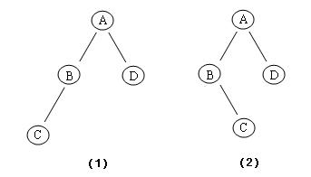

# 前序遍历、中序遍历、后序遍历

---------------------------

有一道很经典而且很多公司喜欢考的题目，就是给定一个二叉树的先序、中序、后序其中两种的遍历，求第三种的遍历。现在分3种情况考虑:

### 1. 已知前序、中序，求后序遍历

前序遍历的规则是:中左右，中序遍历的规则是:左中右。对于一个前序遍历为:ABDECFG，中序遍历为:DBEAFCG 的例子来说。我们知道前序遍历的第一个值A为根节点，于是我们能够将中序遍历的序列拆分成DBE和FCG两段，DBE在A的左子树上，FCG在A的右子树上。我们递归计算DBE和FCG这两段，看这两段中的根节点分别是什么，那么最终能够得到整棵二叉树。

### 2. 已知前序、后序，求中序遍历

在这种情况下，我们只能确定每一层的，无法确定左右子树，所以中序遍历的序列有多种。

### 3. 已知中序、后序，求前序遍历

这种情况和我们的情况1，已知前序、中序，求后序遍历的形式是大体一致的。对于一个中序遍历为:DBEAFCG，后序遍历为:DEBFGCA 的例子来说。后序遍历的最后一个值为根节点，于是可以将中序遍历的序列拆分成DBE和FCG两段，再分别递归计算这两段的根节点，最终得到整棵二叉树。


具体代码可以查看这里的[binaryTree](https://github.com/EdlinLink/AlgorithmTest/tree/master/binaryTree)文件夹的内容。

--------------------------------------------------------
--------------------------------------------------------

### Scily 1210.二叉树

Time Limit: 1sec  
Memory Limit:32MB  

### Description

在众多的数据结构中，二叉树是一种特殊而重要的结构，有着广泛的应用。二叉树或者是一个结点，或者有且仅有一个结点为二叉树的根，其余结点被分成两个互不相交的子集，一个作为左子集，另一个作为右子集，每个子集又是一个二叉树。

遍历一棵二叉树就是按某条搜索路径巡访其中每个结点，使得每个结点均被访问一次，而且仅被访问一次。最常使用的有三种遍历的方式：
1. 前序遍历：若二叉树为空，则空操作；否则先访问根结点，接着前序遍历左子树，最后再前序遍历右子树。
2. 中序遍历：若二叉树为空，则空操作；否则先中序遍历左子树，接着访问根结点，最后再前中遍历右子树。
3. 后序遍历：若二叉树为空，则空操作；否则先后序遍历左子树，接着后序遍历右子树，最后再访问根结点。

例如图(1)所示的二叉树：

<center>  </center>

前序遍历的顺序是ABCD，中序遍历的顺序是CBAD，后序遍历的顺序是CBDA。

对一棵二叉树，如果给出前序遍历和中许遍历的结点访问顺序，那么后序遍历的顺序是唯一确定的，也很方便地求出来。但如果现在只知道前序遍历和后序遍历的顺序，中序遍历的顺序是不确定的，例如：前序遍历的顺序是ABCD，而后序遍历的顺序是CBDA，那么就有两课二叉树满足这样的顺序（见图(1)和图(2)）。

现在的问题是给定前序遍历和后序遍历的顺序，要求出总共有多少棵不同形态的二叉树满足这样的遍历顺序。

### Input

整个输入有两行，第一行给出前序遍历的访问顺序，第二行给出后序遍历的访问顺序。
二叉树的结点用一个大写字母表示，不会有两个结点标上相同字母。输入数据不包含空格，且保证至少有一棵二叉树符合要求。

### Output

输出一个整数，为符合要求的不同形态二叉树的数目。

### Sample Input

	ABCD
	CBDA

### Sample Output

	2

### My Thoughts

考虑简单的两个节点A和B，前序遍历为AB，后序遍历为BA，则会存在两种二叉树: A->left=B和A-right=B，存在不同二叉树的原因在于某节点的缺少其中一个子树，在遍历序列中呈现出前序和后序遍历中节点的值相邻但顺序相反(例如先序AB，后序BA)，那么总的二叉树数量番倍。

### My Code

``` c++
#include <iostream>
#include <string>
#include <cstring>
using namespace std;

int main(){
	string pre, post;
	int index;
	while(cin>>pre>>post){
		int total = 1;
		int len = pre.length();
		for(int i=0; i<len; i++){
			index = post.find(pre[i]);
			if(i+1<len && index-1>=0 && pre[i+1]==post[index-1])
			total*=2;
		}
		cout<<total;
	}
	return 0;
}    
```


--------------------------------------------------------

### 参考资料 

1. [bruce的博客. 先序、中序和后序遍历](http://blog.sina.com.cn/s/blog_788afd2f01016ghz.html)


