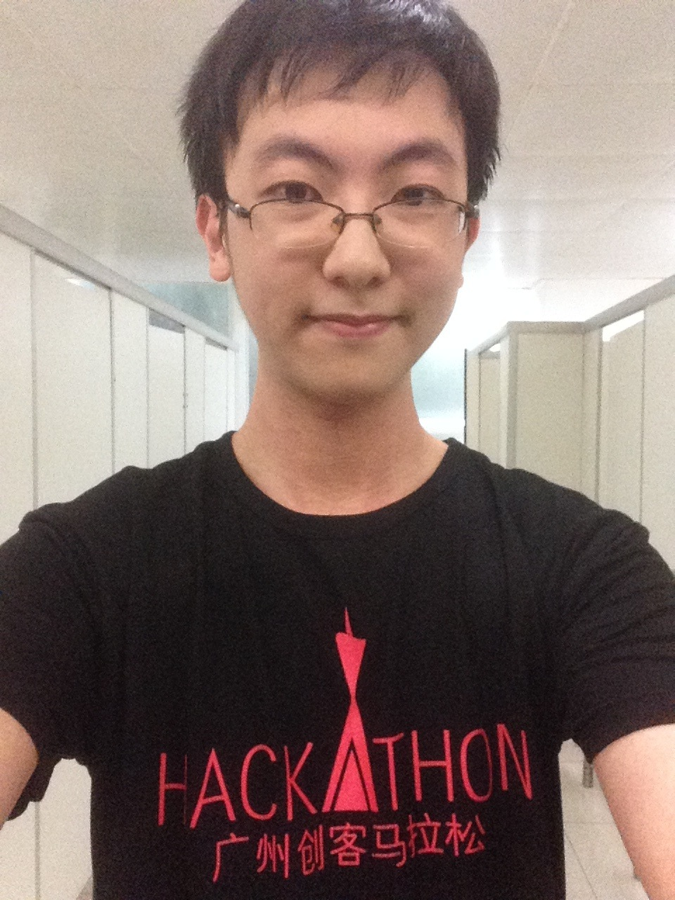
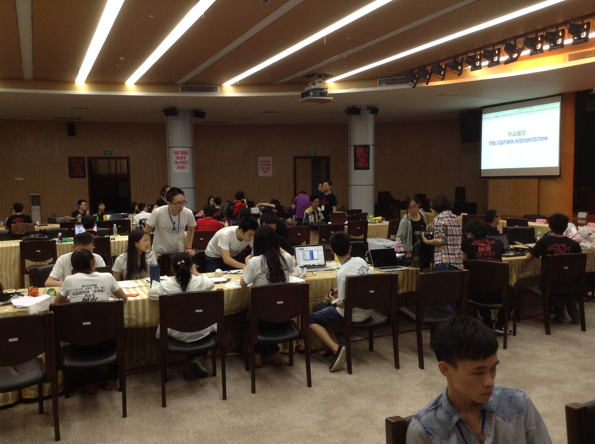
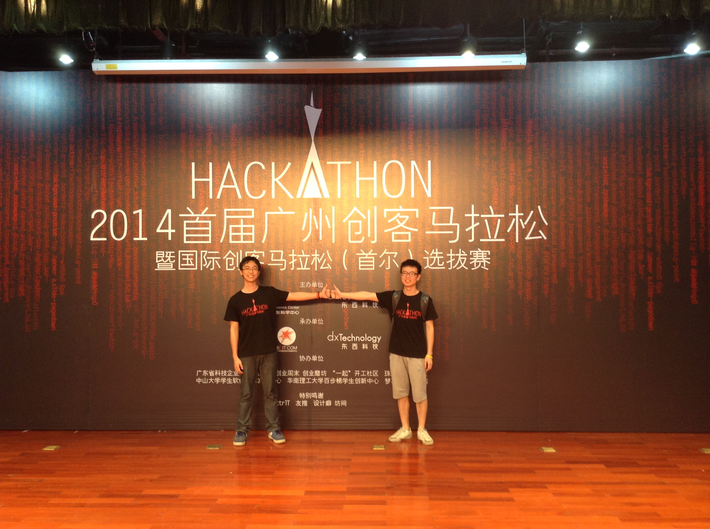
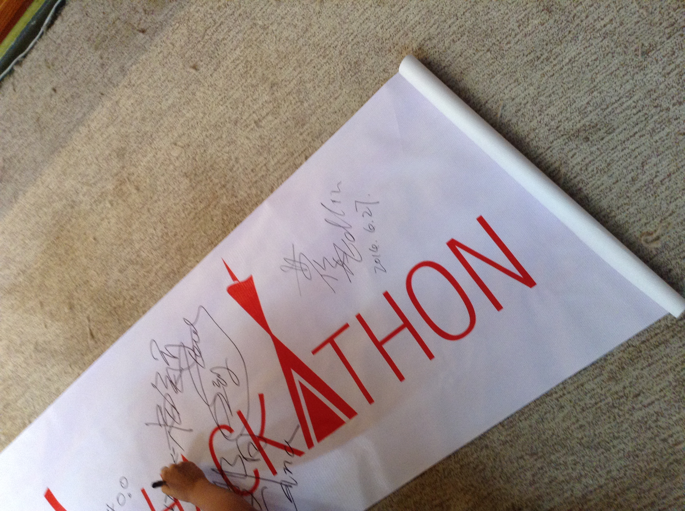
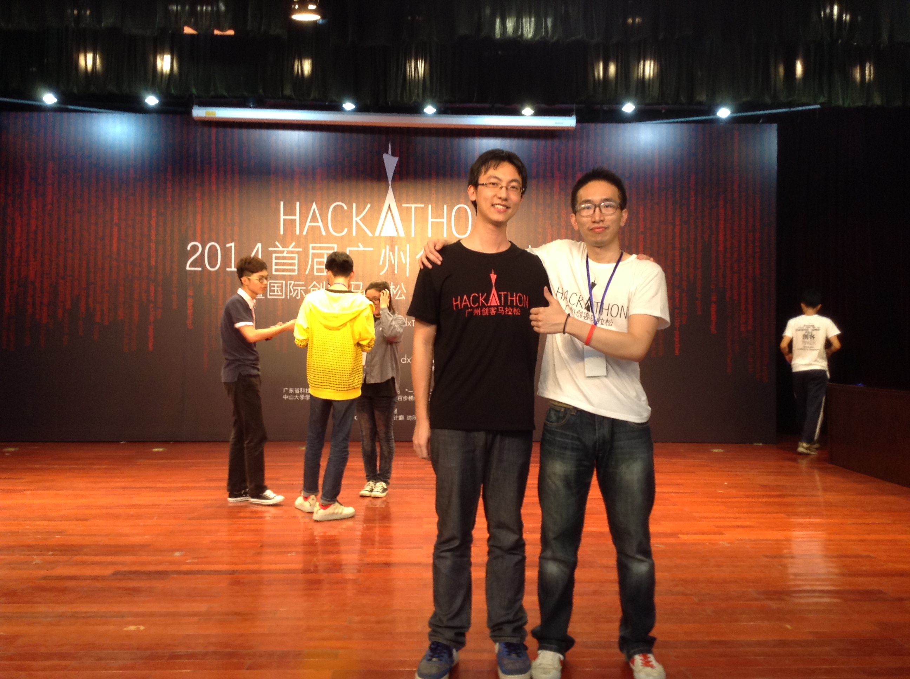

# 2014广州创客马拉松

----------------------

**“创客马拉松发源自美国，一般比赛时间为24至48小时，参赛者在比赛现场临时组队，为共同的构想开发一个产品或产品原型。” —— 广州创客马拉松**

你永远不知道你将获得什么，如果你什么都不去尝试的话。

很庆幸，能够参加到这次的创客马拉松比赛来。一开始完全是抱着过来凑凑热闹的思想准备过来的，不过最后给到自己却是满满的收获。

----------------------------------------------------------------------------

### Day 1

第一天到达场地，其实人不算多，或者换句话说，比我自己预期的要少，大概100来人左右。换上主办方发的衣服后，进入会场。

  

会场布置得很整齐，有休息室和餐饮室，整体来说不错。来参加的人分布还挺广的，主要是大学生（中大、华工、广工、广大），也有已经毕业的年轻人，两个年纪应该三十有余的大叔，还有高中生和一个12岁很可爱的外国小朋友。就算是大学生也有来自不同专业的（计算机、设计、地质、医学!）。

第一天晚上大家主要是抛出自己的想法、寻求小伙伴。正当我苦觅团队的时候（因为我不会硬件也不会Android、ios和Web，所以是苦觅），一个华工学设计的同学和我搭讪组队。他叫南鸿，他很果敢，一找我就定下来一起组队了，我们也顺利成章成为队友。讨论了一番要做什么之后，最后定下来要做一个查找两个关键词之间关系的应用（因为AI课曾经做过一个找关系的基础project），所以想着在它的基础上进行拓展。

第一晚回到宿舍开始爬数据，躺在床上久久不能入睡，虽然自己想要睡觉，但是大脑不断的迸发出项目的各种新想法，而且心里很是激动（没参加过比赛嘛），所以久久不能入睡。不知过了多久，然后发了个梦，梦醒来到了第二天。

-----------------------------------------------------------------------------

### Day 2

知道在大学城北站有车接送到会场后，第二天当然是搭车过去拉。听说有早餐，所以没有吃早餐就过去了。早餐来得比较晚，但是却很丰盛，是M记的早餐套餐!还有其它小零食，巧克力之类的。

早餐过后开始正式动工，南鸿负责设计，我负责实现他的设计以及对我们的软件进行编码。一开始其实都是斗志高昂，渐渐的，心开始平静下来了，打了几个小时代码，开始有点累了。开始东张西望，跑跑洗手间、跑跑餐饮室，站起来随便活动活动......吃过午饭，斗志开始下降，但是不得不继续工作，实现设计，添加功能，调试，交流......开始觉得脑袋发热，感觉像是发烧一样。我曾经觉得编程对自己来说是一件快乐的事情（虽然有时赶porj变得不快乐），但是那时候真的觉得如果以后做程序员，天天都只能坐在电脑前写程序，一定会崩溃的。

编程的时光过得特别快，晚饭时间，更加不舒服了，所以连晚饭都吃不下，只吃了几个巧克力。继续工作，和南鸿聊聊天，9点钟，决定今晚两人都留在会场。那时其实我们的软件设计部分(南鸿负责)已经差不多了，而编码部分(我负责)则只完成了1/4左右。11点，实在是不能继续对着电脑了，我们停下手头的工作去休息室睡觉。休息室准备了沙发和折叠床。我先在沙发上休息，怎么也睡不着，看看南鸿已经睡着了，于是自己又默默起身去会场先要赶赶进度(因为编码部分实在落下太多了)。回来后，选了张折叠床，盖上被子，听者音乐和嘉琪聊完天之后，进入梦乡。

-----------------------------------------------------------------------------

### Day 3

叫醒我的是南鸿，我看看表早上6:58，原来自己睡了这么久，本来想着要休息一下就继续工作的。南鸿告诉我说他2点起来做到5点钟，心生愧疚之情呀。那么只好用自己的力量回报他的这份努力。开始继续工作，到早上9点完成功能一“找关系”，早上10点左右，完成功能四“八卦”，剩下最艰难的功能二和三。会场已经开始热闹起来了，因为下午4点就是截止时间，而且还要准备展示。10点到12点我都在调bug，真是一bug未平，一bug又起。终于1点作用完成了功能三“音乐”功能的一半，商议之后，决定放弃编码，开始准备展示。

要知道hackthon的展示部分才是整个比赛的重中之重，就算你的产品再好，展示不出来，也是白搭。每队有3min展示，联系了好多遍，感觉自己的嘴巴是机关枪了，才能把要展示的内容都说出来。无奈，只能删内容，把重点的重点拿出来讲。

下午4点，截止时间到。定了作品的名字为**求交集**已经提交好作品了，等待的是展示。第9个出场，一共有21组。5点开始的展示推迟到了5:20开始，来得嘉宾都很牛，有创新谷的许老师，6Cit的负责人，UCBerkeley的一个负责创新方面的老师，有米，微信等都有派人过来。

原本以为参赛队伍的作品应该不会做得太好，但是事实上，大大超出了我的预期。无线3D打印机(3D打印机+树莓派实现无线功能)，智能垃圾筒(人经过就会自动打开垃圾盖)，远程爱心杯垫(传送微信信息到达杯垫处播放出来)，心跳回忆(展示心跳，遇到两个一见钟情的人机器会震动哦)。这几个硬件类的产品都使我印象深刻。还有听见(找到附近你想听的歌)，PIPE(将手机内容备份到其它软件)也很不错。还有不得不然我感叹的是自动充气救生衣(触动开关，气囊就能充气)，因为这是一个南校地院大四的同学牵头的项目，在第一天他说他想做这个东西的时候，我觉得他是不是不太了解参加的人基本上都是学软件或设计的，他凭借他的努力召集到一个团队一起努力，最终真的能够有一个实物展示给我们看，这真的让我叹为观止，我在场下真的被他们的展示所折服，深深敬佩他们团队。

过了一轮之后，终于宣布结果了。先宣布4-10名。

**4\. 模块化的3D打印机远程监控管理软件**  
**5\. Free Sports(找空位)**  
**6\. 听·到**  
**7\. 远程爱心水杯垫**  
**8\. 求交集**  
**9\. 自动充气女式救生泳衣**  
**10\. 女性低感内衣**   

先是南鸿叫了起来，我才发现，主持人喊道了**求交集**，这是意想不到，因为我们在下面默默算了算能排在我们后面的队伍大概只有6、7队，所以拿到第八真是一个超级超级意外和惊喜的结果。

前三名分别是:

**1\. 智能垃圾桶**  
**2\. 心跳回忆**  
**3\. 易书岛**  

能拿到前十，真的是十分十分开心的事情。之后是颁奖、合照、签名留念、还有和嘉宾一起交流。在那里和微信部门的Stephen Wang聊了一下，他人很nice还推荐了一个talk给我看，还加了我的微信，超赞!交流的地方还有披萨、鸡腿、土豆锅巴、汽水等吃吃喝喝的。我所写的不够我感受到的百分之一，能够参加到这次广州创客大赛真是一次超级宝贵的经验。最后是一些纪念图片。

  

 截止提交前的会场

  

 和南鸿的合照

  

 横幅上的签名留念

  

 和发起人利嘉豪的合照

