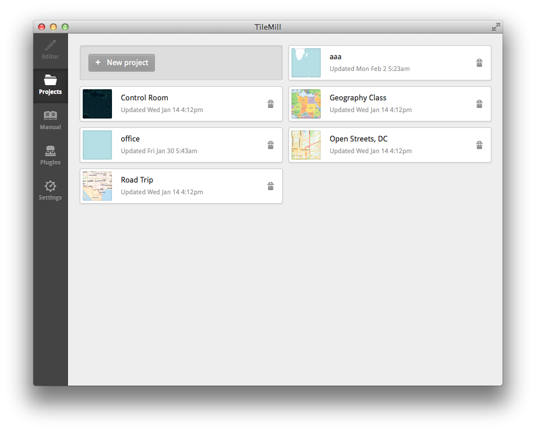
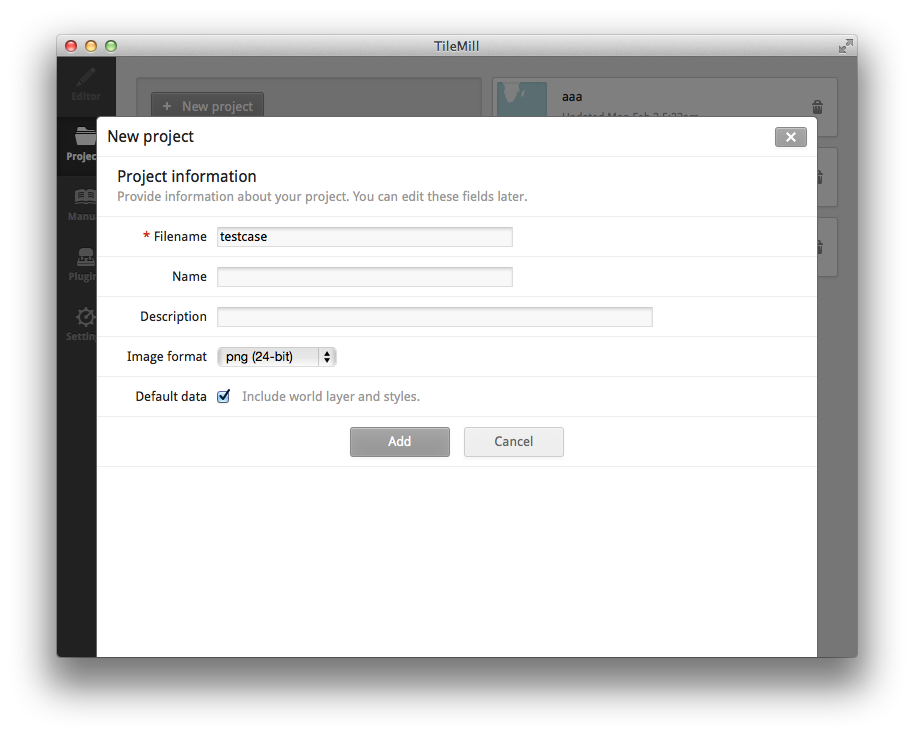
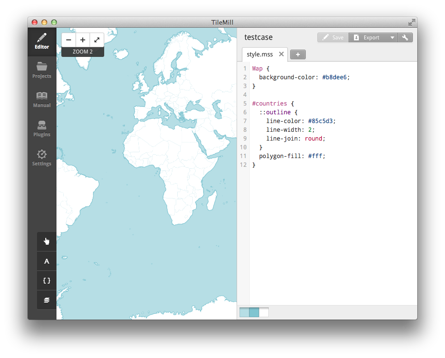
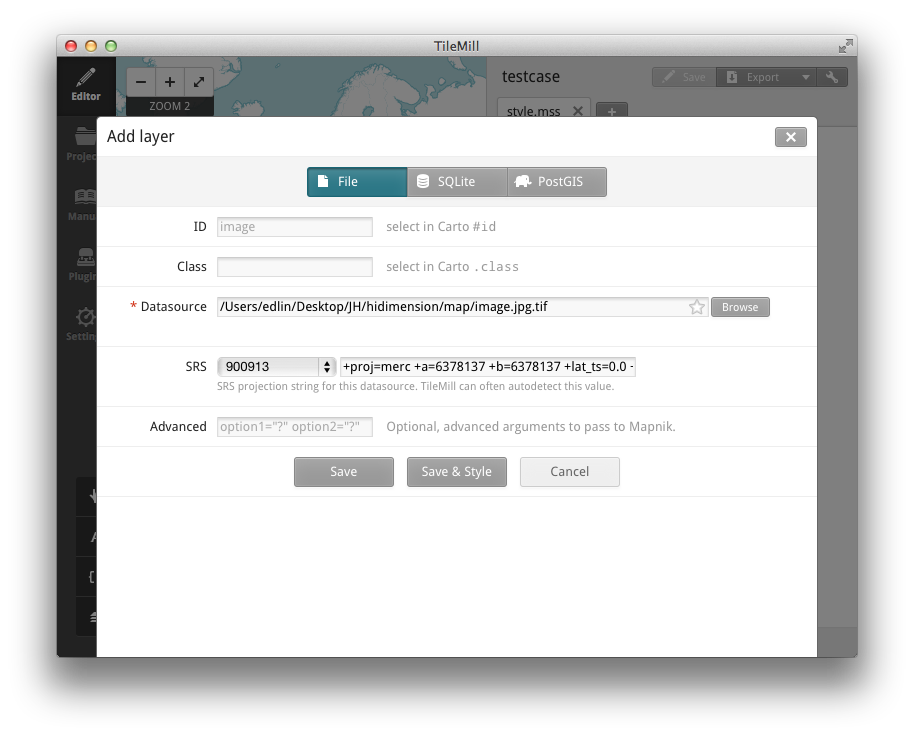
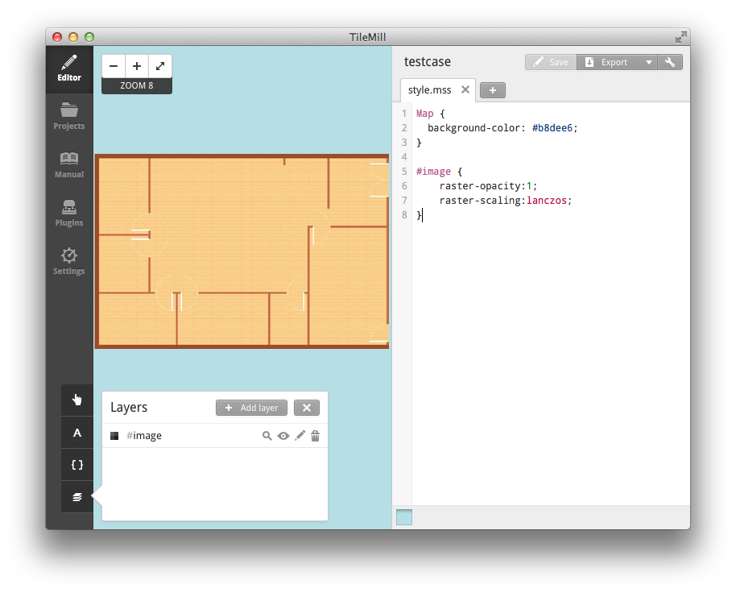
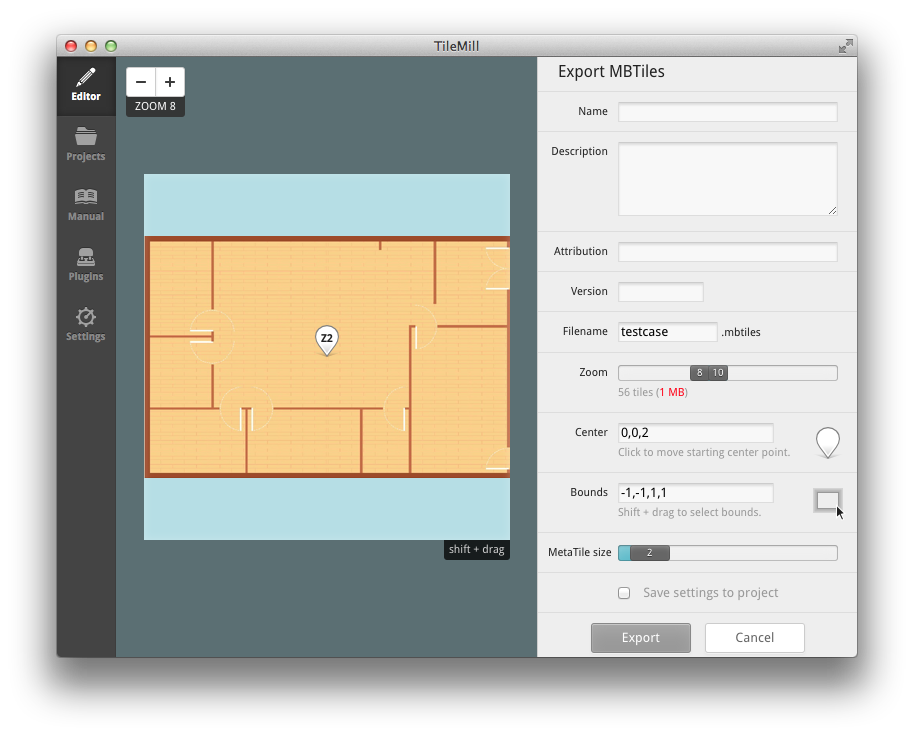

# MapBox 地图制作

---------------------------------------------------------------------------

[Mapbox](https://www.mapbox.com/)是一家地图制作的软件公司，提供了非常好的工具给用户制作真实地图/虚拟地图(例如游戏或者室内地图)。它现在有iOS，Android，JavaScript的SDK，使用起来感觉还是不错的。很多地图模块需要的功能在SDK中都有封装，如果想看实现细节，可以直接在它们的[github](https://github.com/mapbox/mapbox-android-sdk)上查看源码。我只使用过它们的Android SDK和tilemill软件，所以这里只讲一下这两部分。

## Tilemill

[Tilemill](https://www.mapbox.com/tilemill/)是Mapbox提供的地图制作软件，有Mac、Ubuntu和Windows版。使用方法如下(以下以Mac版为例，其他版本类似)，如果你想制作真实的地图，你可以选择Tilemill提供给你的country地图，这个地图已经做的不错了。

1\. New project

2\. Filename可以任意添，其他可以默认

完成后，选择你刚刚新建的project。这个时候Tilemill显示两列，左边是一张世界地图，右边是一个style.mss文件。

Tilemill已经默认帮你添加了一个世界地图的图层，你可以一直放大。左下角第四个按钮"Layer"就是添加图层用的。如果你想在这个世界地图中继续创作，你可以参考Mapbox的[document](https://www.mapbox.com/tilemill/docs/crashcourse/introduction/)。如果你想使用一张自己的图，也是可以的。下面就讲讲怎么使用自己的图作为地图。

## Jpg2Tiff

首先你需要准备一张jpeg的图片，用以下的python脚本把这张图片转成tiff格式。

	#!/usr/bin/python

	#   This file convert .jpg to .geotiff
	#   recieved from: http://www.macwright.org/2012/08/13/images-as-maps.html

	import subprocess
	import sys, re

	sys.path.append('usr/local/Cellar/jpeg/8d/lib/')
	MERC = '+proj=merc +a=6378137 +b=6378137 +lat_ts=0.0 +lon_0=0.0 +x_0=0.0 +y_0=0 +k=1.0 +units=m +nadgrids=@null +wktext +no_defs'

	infile = sys.argv[1]

	print infile

	info_output = subprocess.Popen(['gdalinfo', infile], stdout=subprocess.PIPE).communicate()[0]

	size_is_re = re.compile('Size is (?P<width>\d+), (?P<height>\d+)')
	size_is = filter(lambda x: x, map(lambda x: size_is_re.match(x), info_output.split('\n')))

	if (len(size_is) != 1):
		raise 'Could not parse gdalinfo output for image size'

	size = [float(size_is[0].group('width')), float(size_is[0].group('height'))]

	aspect_ratio = size[1] / size[0]

	# the full world dimension
	dim_w = 20037508.34 / 180
	dim_h = 20037508.34 / 180
	if (aspect_ratio > 1):
		h = dim_h
		w = dim_w / aspect_ratio
	else:
		h = dim_h * aspect_ratio
		w = dim_w
	print h
	print w

	res = subprocess.call(['gdal_translate', '-a_ullr', str(-w), str(-h), str(w), str(h), '-a_srs', MERC, infile, '%s.tif' % infile])

	if res != 0:
		raise 'An error occurred upon calling gdal_translate'

执行这段python脚本需要安装gdal，如果你同样在Mac环境下，可以执行以下命令完成图片从jpg到tiff的转换。

	brew install gdal					//	安装gdal
	pip install gdal					//	安装python gdal

	python jpg2geotiff.py image.jpg		//	脚本名叫jpg2geotiff.py 图片名为image.jpg

执行完脚本后会生成一个叫image.jpg.tiff的文件，这个就是能够导入tilemill的图片了。

---------------------------------------------------------------------------

我们现在可以在tilemill的Layer上删除掉courtries这一个图层，然后点击Add layer。Datasource选择刚刚生成的tiff文件，SRS选择900913。选择好后，ID现在应该默认成图片名字也就是image，点击Save成功保存。

这个时候已经成功导入图片了，但是你还是看不到你的图片，因为你仅仅导入了，但是没有在mss文件中显示出来。你可以仿照courtries图层来写，最简单的，我们可以以下代码，显示图片。

	#image {
		raster-opacity:1;
		raster-scaling:lanczos;
	}

快捷键command+S保存一下，新的图片应该已经出现了。图片默认的经纬度都是[-1,1]。

## Export

点击右上角Export按钮选择MBTiles。点击后右边栏变成设置栏。我们调节zoom至合适区域(zoom下红色数字显示的是导出后的文件大小，尽量选择到处不要超过1M)。Center选择[0,0,2]，Bounds建议选择[-1,-1,1,1]。左上角的ZOOM可以让你调节当前显示的图片大小。

设置好后我们点击Export。此时界面切回主界面，我们选择右上角Export -> View exports。在左边找到刚刚生成的mbtiles文件，选择Save，tilemill会提示保存地点，然后就可以上传到Mapbox你的账户下了。

在Mapbox主页登入账号，点击Data，选择图片上传，等待完成，得到图片id。以后就可以在Android SDK或者其他地方使用这张地图了。

Mapbox最近提高了月免费地图访问量，一个月能有50,000次的免费地图访问，如果你需要更大的访问量，那么就需要付费了。

## 参考资料

1. [Mapbox.com](https://www.mapbox.com/)
2. [mapbox-android-sdk. github.com](https://github.com/mapbox/mapbox-android-sdk)
3. [Tilemill. mapbox.com](https://www.mapbox.com/tilemill/)
4. [Tilemill Document. mapbox.com](https://www.mapbox.com/tilemill/docs/crashcourse/introduction/)
5. [Images as Maps. Tom MacWright. macwright.org](http://www.macwright.org/2012/08/13/images-as-maps.html)
6. [How to Use an Image as Map in TileMill. haidaoxiaofei. haidaoxiaofei.me](http://www.haidaoxiaofei.me/gis/how-image-map.html)
