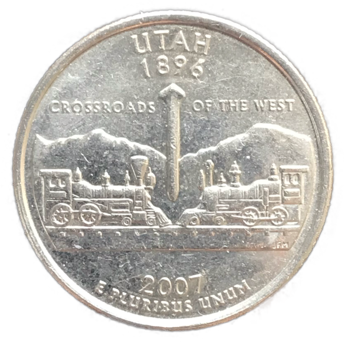

### 前言

因为开始在北美生活，萌生收集美国Quarter（25美分）（1999-2009）的想法。1999-2009年发行的的US Quarter正面是美国第一任总统华盛顿，背面是美国各个州（特区/属地/托管地）的地理特点、历史人物事件或象征，共计56枚。希望能够完成这套集藏。下面是我这套收集的硬币照片，因为是流通币，品相没有很好，但是只要自己喜欢就好。

---

### US 50 State Quarters

Year|-1strelease-|-2ndrelease-|-3rdrelease-|-4threlease-|-5threlease-|-6threlease-
----|---|---|---|---|---|---
1999|Delaware|Pennsylvania|New Jersey|Georgia|Connecticut
2000|Massachusetts{:height="100px"}{:width="100px"}|Maryland{:height="100px"}{:width="100px"}|South Carolina|New Hampshire|Virginia
2001|New York|North Carolina|Rhode Island|Vermont|Kentucky
2002|Tennessee|Ohio|Louisiana|Indiana|Mississippi
2003|Illinois|Alabama{:height="100px"}{:width="100px"}|Maine{:height="100px"}{:width="100px"}|Missouri|Arkansas
2004|Michigan|Florida|Texas{:height="100px"}{:width="100px"}|Iowa|Wisconsin
2005|California|Minnesota|Oregon{:height="100px"}{:width="100px"}|Kansas|West Virginia
2006|Nevada|Nebraska|Colorado|North Dakota|South Dakota
2007|Montana|Washington{:height="100px"}{:width="100px"}|Idaho{:height="100px"}{:width="100px"}|Wyoming{:height="100px"}{:width="100px"}|Utah{:height="100px"}{:width="100px"}
2008|Oklahoma|New Mexico|Arizona{:height="100px"}{:width="100px"}|Alaska|Hawaii{:height="100px"}{:width="100px"}
2009|District of Columbia|Puerto Rico|Guam|American Samoa|U.S. Virgin Islands{:height="100px"}{:width="100px"}|Northern Mariana Islands

### Reference 

+ [美国50州25美分纪念币](https://zh.wikipedia.org/wiki/%E7%BE%8E%E5%9B%BD50%E5%B7%9E25%E7%BE%8E%E5%88%86%E7%BA%AA%E5%BF%B5%E5%B8%81)
+ [50 State Quarters](https://en.wikipedia.org/wiki/50_State_Quarters)
