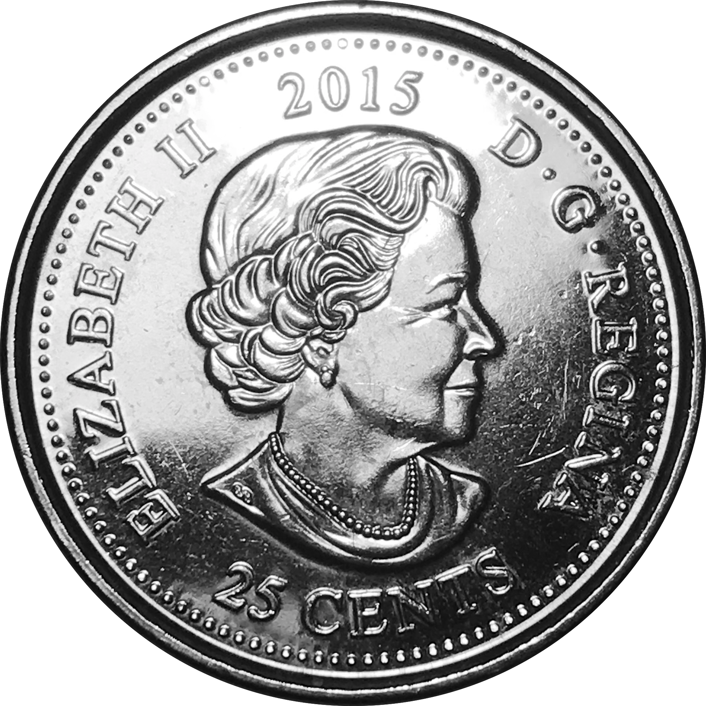
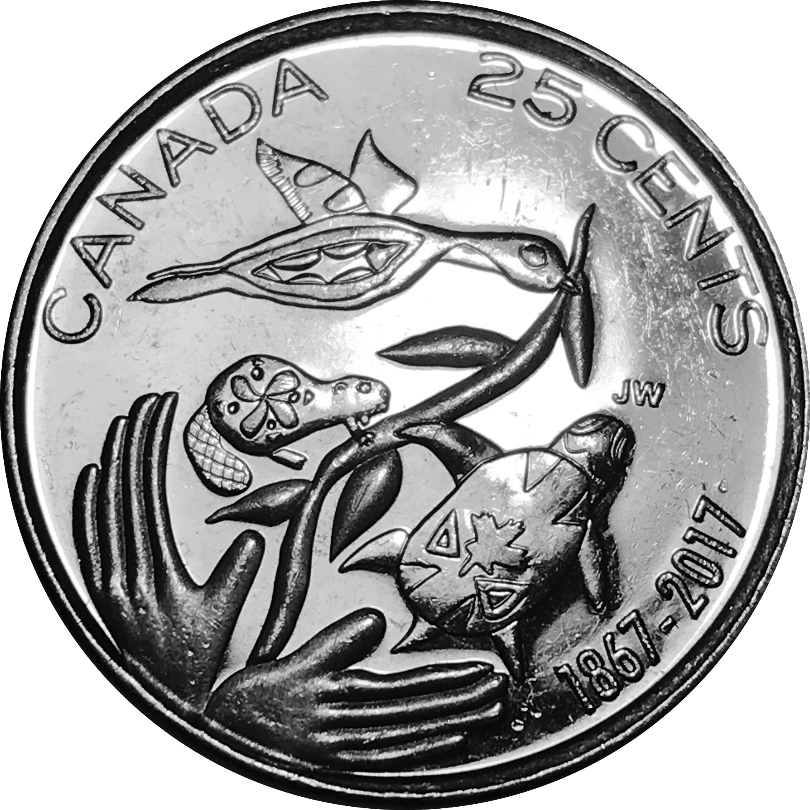
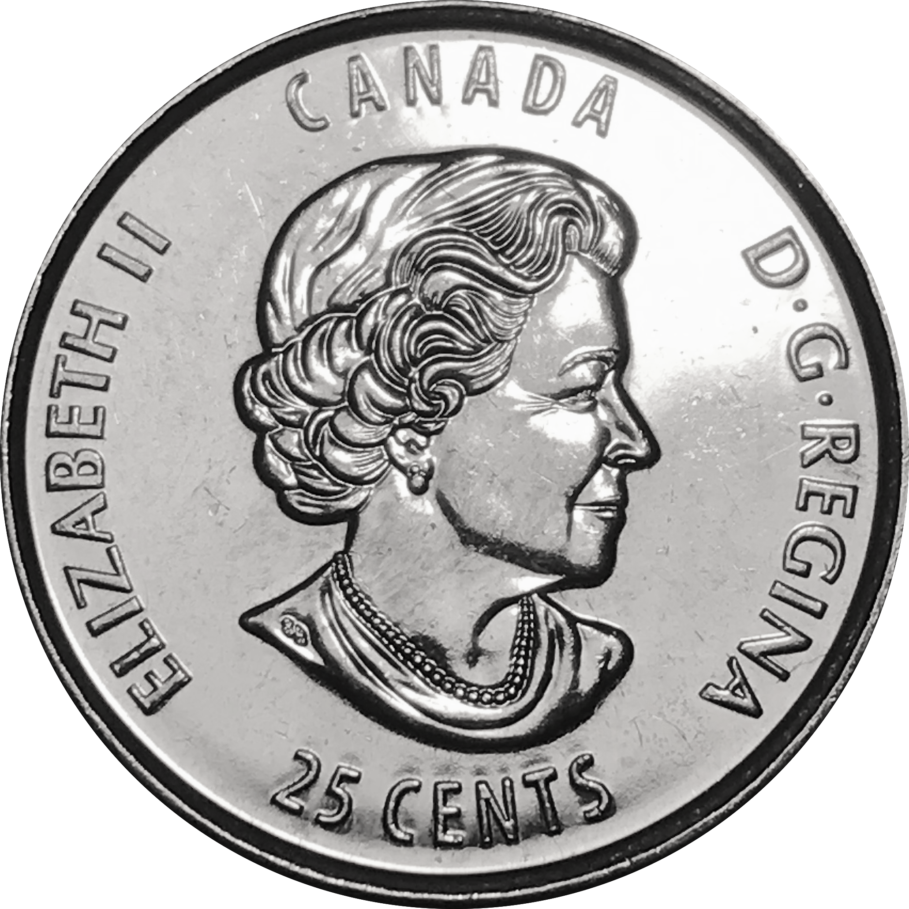
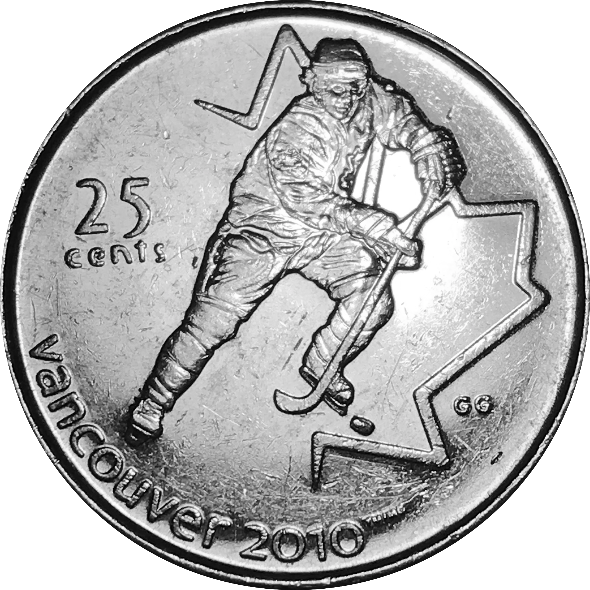
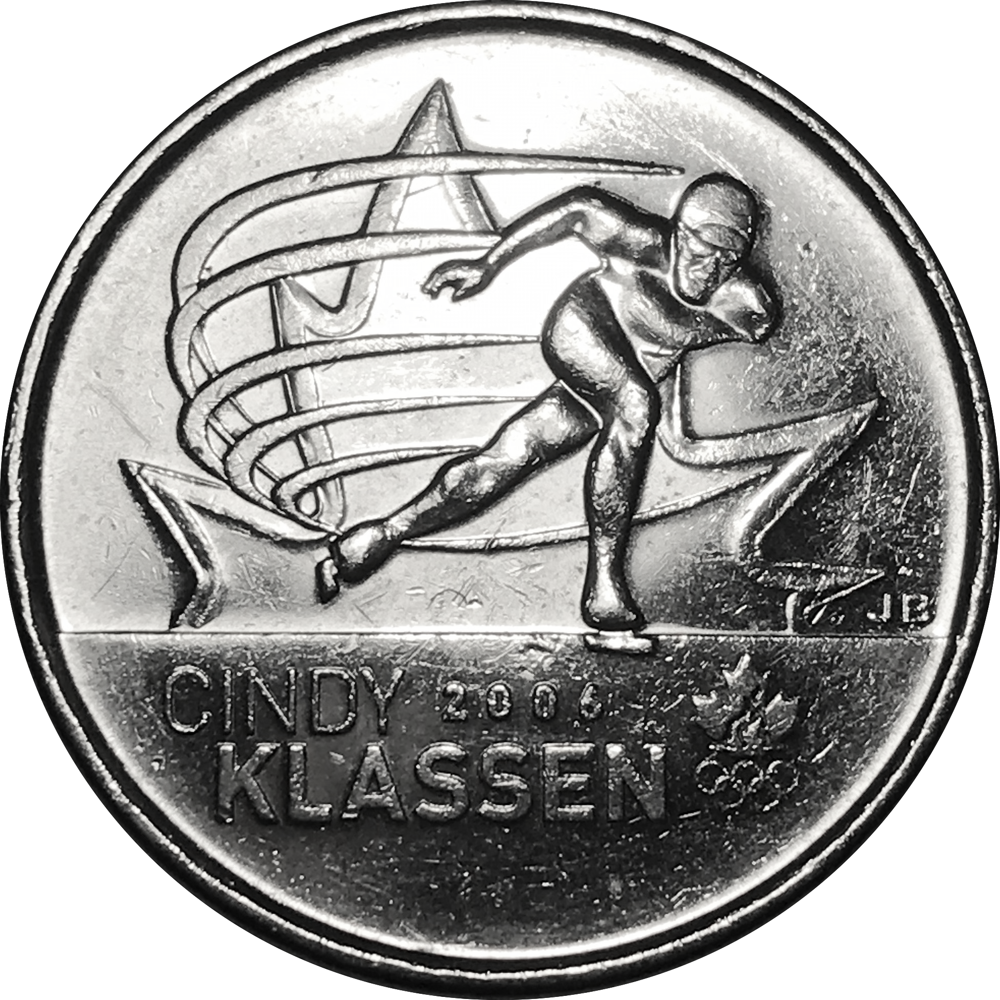

### Single commemorative designs

Year| Reverse | Obverse | Theme
----|---------|---------|-------
2005|{:height="5%"}|{:height="5%"}|Alberta
2015|{:height="5.2%"}|{:height="5.3%"}|100th anniversary of the   writing of *In Flanders Field*
2017|{:height="5.5%"}|{:height="5.5%"}|Canada 150th Anniversary
2017|{:height="5%"}|{:height="5.2%"}|125th anniversary af the Stanley Cup

### Vancouver Olympics

Year| Reverse | Obverse | Theme
----|---------|---------|-------
2007|{:height="4.8%"}|{:height="4.8%"}|Curling
2007|{:height="5%"}|{:height="5.1%"}|Ice Hockey
2007|{:height="5.5%"}|{:height="5%"}|Alpine Skiing
2008|{:height="4.5%"}|{:height="5%"}|Figure Skating
2008|{:height="4.8%"}|{:height="6%"}|Freestyle Skiing
2009|{:height="5.5%"}|{:height="5.5%"}|Speed Skating
2009|{:height="5%"}|{:height="6%"}|Speed Skating
2009|{:height="6%"}|{:height="6%"}|Cindy Klassen

### Reference 

+ [Quarter (Canadian coin)](https://en.wikipedia.org/wiki/Quarter_(Canadian_coin))
